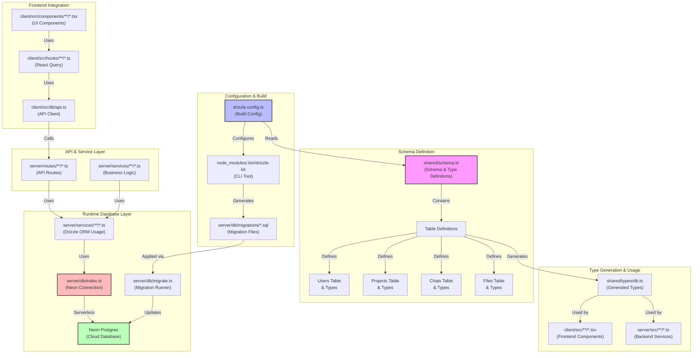
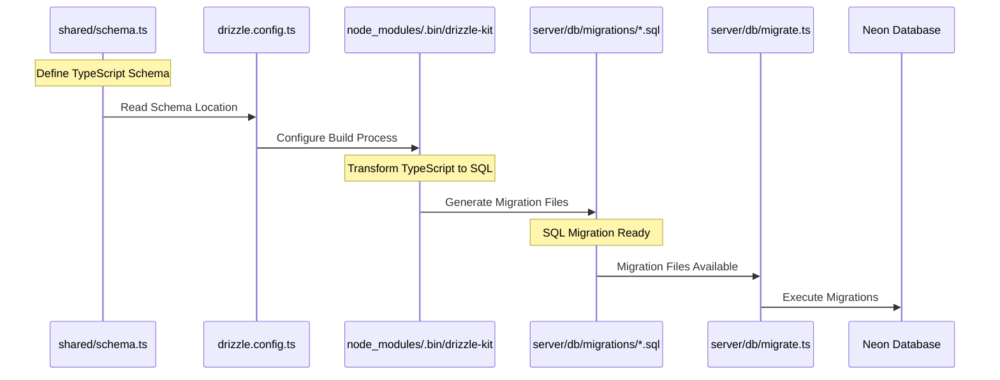
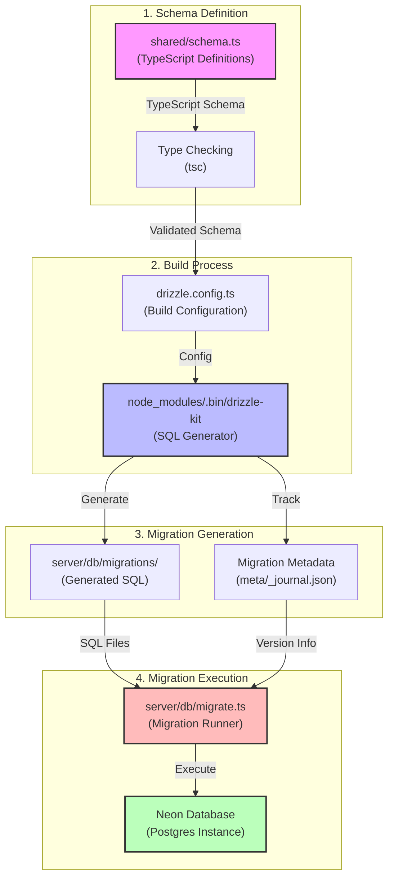

# 🗃️ ORM Comparison: Why We Use Drizzle

This document outlines our choice of Drizzle as our ORM and compares it with alternatives like Prisma, TypeORM, Sequelize, and others, focusing on TypeScript support, performance, and developer experience.

## 📊 Comparison Table

| ORM | Best For | Type Safety | Query Builder | Raw SQL | Bundle Size | Performance | Schema Migration | TypeScript | Learning Curve |
|-----|----------|-------------|---------------|----------|-------------|-------------|-----------------|------------|----------------|
| Drizzle | Modern TypeScript apps, Performance-critical | ⭐⭐⭐⭐⭐ | ✅ Type-safe | ✅ First-class | ~6KB | ⭐⭐⭐⭐⭐ | ✅ Built-in | ✅ First-class | Low |
| Prisma | Rapid development, Complex schemas | ⭐⭐⭐⭐⭐ | ✅ Type-safe | ✅ via PrismaClient | ~40MB | ⭐⭐⭐ | ✅ Built-in | ✅ First-class | Medium |
| TypeORM | Enterprise apps, Complex relations | ⭐⭐⭐⭐ | ✅ Decorator-based | ✅ Supported | ~15MB | ⭐⭐⭐ | ✅ Built-in | ✅ Native | High |
| Sequelize | Legacy projects, Multi-DB | ⭐⭐⭐ | ✅ Chain-based | ✅ Supported | ~12MB | ⭐⭐⭐ | ✅ Built-in | ✅ via Types | Medium |
| Knex.js | Raw SQL lovers, Simple needs | ⭐⭐ | ✅ Chain-based | ✅ Primary focus | ~2MB | ⭐⭐⭐⭐⭐ | ✅ Basic | ❌ Limited | Low |

## 🔄 Architecture Comparison

```mermaid
graph TD
    subgraph "Drizzle Architecture"
        D1[TypeScript Code] -->|Direct| D2[SQL Builder]
        D2 -->|Generates| D3[Raw SQL]
        D3 -->|Executes| D4[Database]
        D2 -->|Infers| D5[Type Definitions]
    end
    
    subgraph "Prisma Architecture"
        P1[Schema.prisma] -->|Generates| P2[Prisma Client]
        P2 -->|Used by| P3[TypeScript Code]
        P3 -->|Queries| P4[Query Engine]
        P4 -->|Executes| P5[Database]
    end
    
    subgraph "Traditional ORM"
        T1[Model Definitions] -->|Generates| T2[Entity Classes]
        T2 -->|Used by| T3[TypeScript Code]
        T3 -->|Through| T4[Query Builder]
        T4 -->|Executes| T5[Database]
    end
```



## 💫 Why We Choose Drizzle

### 1. Superior TypeScript Integration
```typescript
// Drizzle: Type-safe schema definition
import { pgTable, serial, text, timestamp } from 'drizzle-orm/pg-core';

export const users = pgTable('users', {
  id: serial('id').primaryKey(),
  name: text('name').notNull(),
  email: text('email').notNull().unique(),
  createdAt: timestamp('created_at').defaultNow()
});

// Type-safe queries
const result = await db.select()
  .from(users)
  .where(eq(users.email, 'user@example.com'));
// result is fully typed!
```

### 2. Performance Benefits
- No runtime overhead (unlike Prisma's query engine)
- Minimal bundle size (~6KB vs Prisma's ~40MB)
- Direct SQL generation without intermediary layers
- No need for additional processes or binaries

### 3. Developer Experience
```typescript
// Easy relations
export const posts = pgTable('posts', {
  id: serial('id').primaryKey(),
  title: text('title').notNull(),
  authorId: integer('author_id')
    .references(() => users.id)
});

// Type-safe joins
const postsWithAuthors = await db.select()
  .from(posts)
  .leftJoin(users, eq(posts.authorId, users.id));
```

## 🔍 Detailed Comparison with Alternatives

### 1. Drizzle vs Prisma

#### Prisma Approach
```typescript
// Prisma: Schema definition in schema.prisma
model User {
  id        Int      @id @default(autoincrement())
  name      String
  email     String   @unique
  createdAt DateTime @default(now())
}

// Prisma: Query in TypeScript
const user = await prisma.user.findUnique({
  where: { email: 'user@example.com' }
});
```

#### Key Differences
1. **Schema Definition**
   - Drizzle: Pure TypeScript
   - Prisma: Custom DSL (schema.prisma)

2. **Query Engine**
   - Drizzle: Direct SQL generation
   - Prisma: Separate query engine process

3. **Bundle Size**
   - Drizzle: ~6KB
   - Prisma: ~40MB

### 2. Traditional ORMs (TypeORM/Sequelize)

```typescript
// TypeORM approach
@Entity()
class User {
  @PrimaryGeneratedColumn()
  id: number;

  @Column()
  name: string;

  @Column({ unique: true })
  email: string;

  @CreateDateColumn()
  createdAt: Date;
}

// Query
const user = await userRepository.findOne({
  where: { email: 'user@example.com' }
});
```

#### Key Differences
1. **Architecture**
   - Drizzle: SQL-first approach
   - Traditional: Active Record/Data Mapper patterns

2. **Type Safety**
   - Drizzle: Built into core design
   - Traditional: Added as a layer

3. **Performance**
   - Drizzle: Minimal overhead
   - Traditional: Multiple abstraction layers

## 🛠️ Implementation Best Practices

### 1. Schema Definition
```typescript
// /db/schema.ts
import { pgTable, serial, text, timestamp, integer } from 'drizzle-orm/pg-core';

export const users = pgTable('users', {
  id: serial('id').primaryKey(),
  name: text('name').notNull(),
  email: text('email').notNull().unique(),
  createdAt: timestamp('created_at').defaultNow()
});

export const posts = pgTable('posts', {
  id: serial('id').primaryKey(),
  title: text('title').notNull(),
  content: text('content').notNull(),
  authorId: integer('author_id')
    .references(() => users.id),
  createdAt: timestamp('created_at').defaultNow()
});
```

### 2. Type-Safe Queries
```typescript
// /db/queries.ts
import { eq, and, desc } from 'drizzle-orm';
import { db } from './db';
import { users, posts } from './schema';

export const getUserPosts = async (userId: number) => {
  return await db.select()
    .from(posts)
    .where(eq(posts.authorId, userId))
    .orderBy(desc(posts.createdAt));
};
```

### 3. Migrations
```typescript
// /db/migrations/0000_initial.ts
import { sql } from 'drizzle-orm';

export const initialMigration = sql`
  CREATE TABLE users (
    id SERIAL PRIMARY KEY,
    name TEXT NOT NULL,
    email TEXT NOT NULL UNIQUE,
    created_at TIMESTAMP DEFAULT NOW()
  );
`;
```

## 📦 Required Dependencies

```json
{
  "dependencies": {
    "drizzle-orm": "^0.28.0",
    "postgres": "^3.4.0"
  },
  "devDependencies": {
    "drizzle-kit": "^0.19.0"
  }
}
```

## 🎯 Migration Guide (From Prisma)

1. **Schema Translation**
   - Convert Prisma schema to Drizzle TypeScript schema
   - Update relations to use references
   - Migrate enums and custom types

2. **Query Updates**
   - Replace Prisma Client queries with Drizzle queries
   - Update transaction handling
   - Migrate any Prisma-specific features

3. **Migration Handling**
   - Set up drizzle-kit for migrations
   - Create initial migration from existing schema
   - Test migration process

## 🔑 Key Takeaways

1. **Why Drizzle is Better**
   - True TypeScript-first approach
   - Superior performance characteristics
   - Smaller bundle size
   - No external dependencies
   - SQL-first philosophy

2. **When to Consider Alternatives**
   - Prisma: When rapid prototyping is priority
   - TypeORM: For complex enterprise requirements
   - Sequelize: For legacy system compatibility
   - Knex: When you need just a query builder

3. **Our Usage Pattern**
   - Direct SQL generation
   - Type-safe queries
   - Efficient joins and relations
   - Easy migration handling 

## 🏗️ Our Drizzle Implementation

### Directory Structure
```plaintext
better-gpt/
├── shared/
│   ├── schema/
│   │   ├── index.ts        # Exports all schemas
│   │   ├── projects.ts     # Project schema
│   │   ├── chats.ts        # Chat schema
│   │   ├── files.ts        # File schema
│   │   └── users.ts        # User schema
│   └── types/
│       └── db.ts           # Inferred types from schema
├── server/
│   ├── db/
│   │   ├── index.ts        # Database connection
│   │   └── migrations/     # Generated migrations
│   └── services/
│       └── db.ts          # Database service
└── drizzle.config.ts      # Drizzle configuration
```

### Schema Definition (Shared Types)

```typescript
// shared/schema/index.ts
export * from './projects';
export * from './chats';
export * from './files';
export * from './users';

// shared/schema/projects.ts
import { pgTable, serial, text, timestamp, varchar, jsonb } from 'drizzle-orm/pg-core';
import { createInsertSchema, createSelectSchema } from 'drizzle-zod';
import { z } from 'zod';

export const projects = pgTable('projects', {
  id: serial('id').primaryKey(),
  name: varchar('name', { length: 255 }).notNull(),
  description: text('description'),
  instructions: text('instructions'),
  settings: jsonb('settings').$type<ProjectSettings>().default({}),
  created_at: timestamp('created_at').defaultNow(),
  updated_at: timestamp('updated_at').defaultNow()
});

// Zod schema for validation
export const insertProjectSchema = createInsertSchema(projects, {
  name: z.string().min(1).max(255),
  description: z.string().optional(),
  instructions: z.string().optional(),
  settings: z.object({
    aiModel: z.string().default('gpt-4'),
    temperature: z.number().min(0).max(2).default(0.7),
    maxTokens: z.number().min(1).max(32000).default(4000)
  }).optional()
});

// Inferred types
export type Project = typeof projects.$inferSelect;
export type NewProject = typeof projects.$inferInsert;
export type ProjectSettings = {
  aiModel?: string;
  temperature?: number;
  maxTokens?: number;
};

// shared/schema/chats.ts
export const chats = pgTable('chats', {
  id: serial('id').primaryKey(),
  project_id: integer('project_id')
    .references(() => projects.id)
    .notNull(),
  title: varchar('title', { length: 255 }).notNull(),
  messages: jsonb('messages').$type<ChatMessage[]>().default([]),
  created_at: timestamp('created_at').defaultNow(),
  updated_at: timestamp('updated_at').defaultNow()
});

export type ChatMessage = {
  role: 'user' | 'assistant' | 'system';
  content: string;
  timestamp: string;
};
```

### Database Configuration

```typescript
// drizzle.config.ts
import type { Config } from 'drizzle-kit';

export default {
  schema: './shared/schema/*',
  out: './server/db/migrations',
  driver: 'pg',
  dbCredentials: {
    connectionString: process.env.DATABASE_URL!
  },
  verbose: true,
  strict: true
} satisfies Config;

// server/db/index.ts
import { drizzle } from 'drizzle-orm/node-postgres';
import { Pool } from 'pg';
import * as schema from '@/shared/schema';

const pool = new Pool({
  connectionString: process.env.DATABASE_URL
});

export const db = drizzle(pool, { schema });
```

### Service Layer Implementation

```typescript
// server/services/db.ts
import { db } from '@/db';
import { eq, and, desc } from 'drizzle-orm';
import { projects, chats, files } from '@/shared/schema';
import type { NewProject, Project, ChatMessage } from '@/shared/types/db';

export class DatabaseService {
  // Project operations
  async createProject(data: NewProject): Promise<Project> {
    const [project] = await db.insert(projects)
      .values(data)
      .returning();
    return project;
  }

  async getProjectWithChats(projectId: number) {
    return await db.query.projects.findFirst({
      where: eq(projects.id, projectId),
      with: {
        chats: {
          orderBy: desc(chats.created_at)
        },
        files: true
      }
    });
  }

  // Chat operations
  async createChat(projectId: number, title: string) {
    const [chat] = await db.insert(chats)
      .values({
        project_id: projectId,
        title,
        messages: []
      })
      .returning();
    return chat;
  }

  async addMessageToChat(chatId: number, message: ChatMessage) {
    const [chat] = await db.update(chats)
      .set({
        messages: sql`array_append(${chats.messages}, ${JSON.stringify(message)}::jsonb)`,
        updated_at: new Date()
      })
      .where(eq(chats.id, chatId))
      .returning();
    return chat;
  }

  // Transaction example
  async createProjectWithChat(
    projectData: NewProject,
    chatTitle: string
  ) {
    return await db.transaction(async (tx) => {
      const [project] = await tx.insert(projects)
        .values(projectData)
        .returning();

      const [chat] = await tx.insert(chats)
        .values({
          project_id: project.id,
          title: chatTitle
        })
        .returning();

      return { project, chat };
    });
  }
}
```

### Type-Safe Queries with Relations

```typescript
// Example of complex queries with type safety
const getProjectAnalytics = async (projectId: number) => {
  const result = await db.select({
    project: projects,
    chatCount: sql<number>`count(distinct ${chats.id})::int`,
    fileCount: sql<number>`count(distinct ${files.id})::int`,
    lastActive: sql<Date>`max(${chats.updated_at})`
  })
  .from(projects)
  .leftJoin(chats, eq(chats.project_id, projects.id))
  .leftJoin(files, eq(files.project_id, projects.id))
  .where(eq(projects.id, projectId))
  .groupBy(projects.id);

  return result[0];
};
```

### Migration Management

```typescript
// server/db/migrations/0000_initial.ts
import { sql } from 'drizzle-orm';

export const initialMigration = sql`
  CREATE TABLE projects (
    id SERIAL PRIMARY KEY,
    name VARCHAR(255) NOT NULL,
    description TEXT,
    instructions TEXT,
    settings JSONB DEFAULT '{}',
    created_at TIMESTAMP DEFAULT NOW(),
    updated_at TIMESTAMP DEFAULT NOW()
  );

  CREATE TABLE chats (
    id SERIAL PRIMARY KEY,
    project_id INTEGER NOT NULL REFERENCES projects(id),
    title VARCHAR(255) NOT NULL,
    messages JSONB DEFAULT '[]',
    created_at TIMESTAMP DEFAULT NOW(),
    updated_at TIMESTAMP DEFAULT NOW()
  );

  -- Add indexes for better query performance
  CREATE INDEX idx_chats_project_id ON chats(project_id);
  CREATE INDEX idx_chats_created_at ON chats(created_at DESC);
`;
```

### API Layer Integration

```typescript
// server/routes/projects.ts
import { Router } from 'express';
import { DatabaseService } from '@/services/db';
import { insertProjectSchema } from '@/shared/schema';

const router = Router();
const db = new DatabaseService();

router.post('/', async (req, res) => {
  const data = insertProjectSchema.parse(req.body);
  const project = await db.createProject(data);
  res.json(project);
});

router.get('/:id', async (req, res) => {
  const projectId = parseInt(req.params.id);
  const project = await db.getProjectWithChats(projectId);
  res.json(project);
});

export default router;
```

### React Query Integration

```typescript
// client/src/hooks/useProject.ts
import { useQuery, useMutation } from '@tanstack/react-query';
import type { Project, NewProject } from '@/shared/types/db';

export const useProject = (projectId: number) => {
  return useQuery({
    queryKey: ['project', projectId],
    queryFn: () => fetch(`/api/projects/${projectId}`).then(r => r.json())
  });
};

export const useCreateProject = () => {
  return useMutation({
    mutationFn: (data: NewProject) =>
      fetch('/api/projects', {
        method: 'POST',
        headers: { 'Content-Type': 'application/json' },
        body: JSON.stringify(data)
      }).then(r => r.json())
  });
};
```

This implementation provides:

1. **Type Safety**: Full TypeScript support across the stack
2. **Performance**: Efficient SQL generation and execution
3. **Maintainability**: Clear separation of concerns
4. **Scalability**: Easy to add new features and relations
5. **Developer Experience**: Great IDE support and type inference

The schema definitions are shared between frontend and backend, ensuring type safety throughout the application. The service layer provides a clean API for database operations, while the React Query integration enables efficient client-side data management. 

## 🔄 Schema Organization & Data Flow

### Step-by-Step Flow

1. **Schema Organization**
   - We maintain a single `shared/schema.ts` file
   - This file contains ALL our Drizzle schema definitions
   - Keeps our type definitions centralized and atomic
   - Enables single source of truth for database structure

2. **Type Generation Process**
   ```typescript
   // shared/schema.ts
   import { pgTable, serial, text, timestamp } from 'drizzle-orm/pg-core';
   
   // All schemas defined in one file for atomic type generation
   export const users = pgTable('users', { ... });
   export const projects = pgTable('projects', { ... });
   export const chats = pgTable('chats', { ... });
   export const files = pgTable('files', { ... });
   ```

3. **Drizzle Configuration**
   ```typescript
   // drizzle.config.ts
   import type { Config } from 'drizzle-kit';
   
   export default {
     schema: './shared/schema.ts', // Single schema file
     out: './server/db/migrations',
     driver: 'pg',
     dbCredentials: {
       connectionString: process.env.NEON_DATABASE_URL
     },
     verbose: true,
     strict: true
   } satisfies Config;
   ```

4. **Migration Generation**
   - Drizzle reads our schema.ts
   - Converts TypeScript definitions to SQL
   - Generates migration files
   - Tracks schema changes over time

5. **Database Connection**
   ```typescript
   // server/db/index.ts
   import { drizzle } from 'drizzle-orm/neon-http';
   import { neon } from '@neondatabase/serverless';
   import * as schema from '@/shared/schema';
   
   const sql = neon(process.env.NEON_DATABASE_URL!);
   export const db = drizzle(sql, { schema });
   ```

### Visual Flow Diagram with File Paths



### File-Based Flow Explanation

1. **Schema Definition & Types**
   ```plaintext
   shared/
   ├── schema.ts                 # Core schema definitions
   │   ├── Table Definitions     # pgTable definitions
   │   ├── Type Exports         # Inferred types
   │   └── Zod Schemas          # Validation schemas
   └── types/
       └── db.ts                # Generated TypeScript types
   ```

2. **Build & Configuration**
   ```plaintext
   /
   ├── drizzle.config.ts        # Drizzle configuration
   └── server/
       └── db/
           ├── migrations/      # Generated SQL migrations
           │   ├── 0000_*.sql  # Migration files
           │   └── meta/       # Migration metadata
           └── migrate.ts      # Migration runner script
   ```

3. **Database Connection**
   ```plaintext
   server/
   ├── db/
   │   └── index.ts            # Neon connection setup
   └── services/
       ├── project.service.ts  # Project operations
       ├── chat.service.ts     # Chat operations
       └── file.service.ts     # File operations
   ```

4. **API Layer**
   ```plaintext
   server/
   ├── routes/
   │   ├── project.routes.ts   # Project endpoints
   │   ├── chat.routes.ts      # Chat endpoints
   │   └── file.routes.ts      # File endpoints
   └── middleware/
       └── validation.ts       # Request validation
   ```

5. **Frontend Integration**
   ```plaintext
   client/src/
   ├── lib/
   │   └── api.ts             # API client setup
   ├── hooks/
   │   ├── useProject.ts      # Project operations
   │   ├── useChat.ts         # Chat operations
   │   └── useFile.ts         # File operations
   └── components/
       └── **/*.tsx           # React components
   ```

### Data Flow Through Files

1. **Schema to Database**
   ```mermaid
   sequenceDiagram
       participant S as shared/schema.ts
       participant D as drizzle.config.ts
       participant M as server/db/migrations/
       participant DB as Neon Database

       S->>D: Define Schema
       D->>M: Generate Migrations
       M->>DB: Apply Changes
   ```

2. **API Request Flow**
   ```mermaid
   sequenceDiagram
       participant C as Component
       participant H as Hook
       participant R as Route
       participant S as Service
       participant DB as Database

       C->>H: Call Hook
       H->>R: API Request
       R->>S: Service Call
       S->>DB: Database Query
       DB-->>C: Type-Safe Response
   ```

This enhanced visualization shows:
- Exact file locations for each operation
- How files interact with each other
- Where types are generated and used
- Complete flow from schema to UI
- Integration points between layers

Each file serves a specific purpose in the flow:
1. `schema.ts` - Single source of truth
2. `drizzle.config.ts` - Build configuration
3. `migrations/*.sql` - Database changes
4. `db/index.ts` - Database connection
5. `services/*.ts` - Business logic
6. `routes/*.ts` - API endpoints
7. `hooks/*.ts` - Frontend data access
8. `components/*.tsx` - UI rendering

This architecture ensures:
- Type safety across the entire stack
- Single source of truth for database schema
- Efficient database operations via Neon
- Clear and maintainable code structure
- Optimal developer experience

This implementation provides:
- Type safety across the entire stack
- Single source of truth for database schema
- Efficient database operations via Neon
- Clear and maintainable code structure
- Optimal developer experience

The schema definitions are shared between frontend and backend, ensuring type safety throughout the application. The service layer provides a clean API for database operations, while the React Query integration enables efficient client-side data management. 

### TypeScript to SQL Transformation Flow



### File-by-File Transformation Process

1. **TypeScript Schema Definition**
   ```typescript
   // shared/schema.ts
   import { pgTable, serial, text, timestamp } from 'drizzle-orm/pg-core';
   
   export const users = pgTable('users', {
     id: serial('id').primaryKey(),
     name: text('name').notNull(),
     email: text('email').notNull().unique()
   });
   ```

2. **Drizzle Configuration**
   ```typescript
   // drizzle.config.ts
   import type { Config } from 'drizzle-kit';
   
   export default {
     schema: './shared/schema.ts',    // Source TypeScript schema
     out: './server/db/migrations',   // Output SQL location
     driver: 'pg',                    // Database type
     dbCredentials: {
       connectionString: process.env.NEON_DATABASE_URL
     }
   } satisfies Config;
   ```

3. **Migration Generation**
   ```bash
   # Command executed (npm script)
   # package.json
   {
     "scripts": {
       "db:generate": "drizzle-kit generate:pg",  # Converts TS to SQL
       "db:migrate": "tsx server/db/migrate.ts"    # Applies SQL to database
     }
   }
   ```

4. **Generated SQL Migration**
   ```sql
   -- server/db/migrations/0000_initial.sql
   -- Auto-generated by Drizzle-Kit
   CREATE TABLE IF NOT EXISTS "users" (
     "id" SERIAL PRIMARY KEY,
     "name" TEXT NOT NULL,
     "email" TEXT NOT NULL,
     CONSTRAINT "users_email_unique" UNIQUE ("email")
   );
   ```

5. **Migration Runner**
   ```typescript
   // server/db/migrate.ts
   import { drizzle } from 'drizzle-orm/neon-http';
   import { neon } from '@neondatabase/serverless';
   import { migrate } from 'drizzle-orm/neon-http/migrator';
   
   const sql = neon(process.env.NEON_DATABASE_URL!);
   const db = drizzle(sql);
   
   // Applies migrations from server/db/migrations
   await migrate(db, { migrationsFolder: './server/db/migrations' });
   ```

### Transformation Steps in Detail



### File Structure for Schema Transformation

```plaintext
project-root/
├── shared/
│   └── schema.ts                    # TypeScript schema definitions
├── drizzle.config.ts               # Build & transform configuration
├── server/
│   └── db/
│       ├── migrations/             # Generated SQL files
│       │   ├── 0000_initial.sql   # First migration
│       │   ├── 0001_changes.sql   # Subsequent migrations
│       │   └── meta/
│       │       └── _journal.json  # Migration metadata
│       └── migrate.ts             # Migration execution script
└── package.json                    # NPM scripts for db operations
```

### Key Transformation Points

1. **TypeScript → SQL (Generation)**
   - Source: `shared/schema.ts`
   - Tool: `drizzle-kit` (via `npm run db:generate`)
   - Output: `server/db/migrations/*.sql`

2. **SQL → Database (Execution)**
   - Source: `server/db/migrations/*.sql`
   - Tool: `migrate.ts` (via `npm run db:migrate`)
   - Target: Neon Postgres Database

3. **Version Control**
   - Location: `server/db/migrations/meta/_journal.json`
   - Purpose: Tracks applied migrations
   - Updates: Automatic during migration process

### Example Migration Workflow

```bash
# 1. Make changes to schema.ts
vim shared/schema.ts

# 2. Generate new migration
npm run db:generate

# 3. Review generated SQL
cat server/db/migrations/0001_new_changes.sql

# 4. Apply migration to database
npm run db:migrate
```

This process ensures:
- Type safety during schema definition
- Accurate SQL generation
- Version-controlled schema changes
- Safe database updates
- Reproducible database state