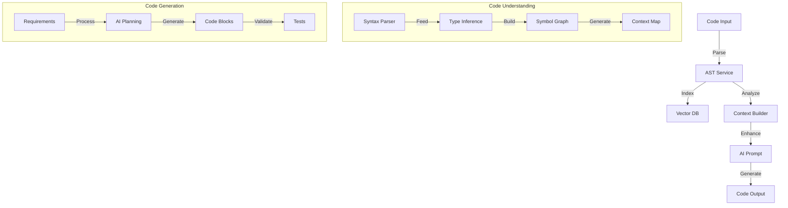
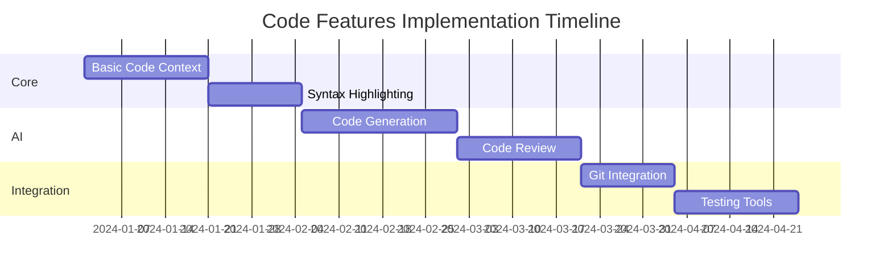

# 🔍 Code Features & Integration for BetterGPT

This document outlines the code-specific features and integrations for BetterGPT, focusing on code understanding, generation, and collaboration capabilities.

## 📊 Core Code Features Overview

| Feature | Description | Priority | Integration Points | Documentation |
|---------|-------------|----------|-------------------|---------------|
| Code Context | Language detection, syntax highlighting, AST parsing | P0 | TipTap, Monaco Editor | [monaco-editor.md](/React Libraries/WYSIWYG/monaco-editor.md) |
| Code Generation | AI-assisted code completion, refactoring suggestions | P0 | OpenAI API | [openai-integration.md](/React Integrations/openai-integration.md) |
| Code Search | Semantic code search, symbol navigation | P1 | pgvector, AST indexing | Coming Soon |
| Version Control | Git integration, diff viewing, commit suggestions | P1 | Git, GitHub API | Coming Soon |
| Code Review | AI-assisted code review, best practice suggestions | P2 | OpenAI API, GitHub API | [openai-integration.md](/React Integrations/openai-integration.md) |
| Testing | Test generation, coverage analysis | P2 | Jest, Vitest | [vitest.md](/React Libraries/Testing/vitest.md) |

## 🔄 Code Processing Architecture



## 💡 Key Implementation Features

### 1. Code Context Management

```typescript
interface CodeContext {
  language: string;
  dependencies: {
    imports: Import[];
    packages: Package[];
  };
  scope: {
    variables: Variable[];
    functions: Function[];
    classes: Class[];
  };
  fileTree: FileTreeNode[];
  gitContext?: GitContext;
}

// Context builder service
class CodeContextBuilder {
  async buildContext(code: string): Promise<CodeContext> {
    const ast = await this.parseCode(code);
    const deps = await this.analyzeDependencies(ast);
    const scope = this.analyzeScope(ast);
    return {
      language: this.detectLanguage(code),
      dependencies: deps,
      scope: scope,
      fileTree: await this.buildFileTree()
    };
  }
}
```

### 2. Intelligent Code Generation

```typescript
interface CodeGenRequest {
  prompt: string;
  context: CodeContext;
  constraints: {
    language: string;
    style: CodeStyle;
    maxTokens: number;
  };
  tests?: TestRequirements;
}

class CodeGenerator {
  async generateCode(request: CodeGenRequest): Promise<CodeGenResponse> {
    const enhancedPrompt = await this.buildPrompt(request);
    const completion = await this.ai.complete(enhancedPrompt);
    const validated = await this.validateCode(completion);
    return {
      code: validated.code,
      explanation: validated.explanation,
      tests: validated.tests
    };
  }
}
```

### 3. Code Search & Navigation

```typescript
interface CodeSearchOptions {
  query: string;
  filters: {
    language?: string[];
    fileTypes?: string[];
    modifiedSince?: Date;
  };
  context?: CodeContext;
}

class CodeSearchEngine {
  async semanticSearch(options: CodeSearchOptions): Promise<SearchResult[]> {
    const embedding = await this.embedQuery(options.query);
    const results = await this.vectorDb.search(embedding);
    return this.rankAndFilter(results, options);
  }
}
```

## 🛠️ Integration with Editor

```typescript
// TipTap Code Block Extension
const CodeBlock = Extension.create({
  name: 'codeBlock',
  
  addOptions() {
    return {
      languageDetection: true,
      syntaxHighlighting: true,
      lineNumbers: true,
      aiAssist: true
    };
  },
  
  addCommands() {
    return {
      insertCodeBlock: () => ({ commands }) => {
        return commands.insertContent({
          type: 'codeBlock',
          attrs: { language: 'typescript' }
        });
      },
      
      suggestCompletion: () => async ({ state, view }) => {
        const context = await buildContext(state);
        const suggestion = await generateCompletion(context);
        return commands.insertContent(suggestion);
      }
    };
  }
});
```

## 🔧 Development Tools Integration

### Git Integration

```typescript
interface GitContext {
  branch: string;
  recentCommits: Commit[];
  diffStats: DiffStats;
  conflictRegions?: ConflictRegion[];
}

class GitIntegration {
  async suggestCommitMessage(diff: string): Promise<string> {
    const context = await this.buildGitContext();
    return this.ai.suggestCommit(diff, context);
  }
  
  async reviewChanges(pr: PullRequest): Promise<ReviewComments[]> {
    const changes = await this.getPRChanges(pr);
    return this.ai.reviewCode(changes);
  }
}
```

### Testing Integration

```typescript
interface TestGenRequest {
  code: string;
  context: CodeContext;
  coverage: {
    statements: number;
    branches: number;
    functions: number;
    lines: number;
  };
}

class TestGenerator {
  async generateTests(request: TestGenRequest): Promise<TestSuite> {
    const testCases = await this.analyzeCodeForTests(request);
    const generatedTests = await this.ai.generateTests(testCases);
    return this.validateTests(generatedTests);
  }
}
```

## 📦 Required Dependencies

```json
{
  "dependencies": {
    "@monaco-editor/react": "^4.6.0",
    "prettier": "^3.0.0",
    "ast-parser": "^0.2.0",
    "simple-git": "^3.20.0",
    "@octokit/rest": "^19.0.0",
    "jest": "^29.0.0",
    "@types/jest": "^29.0.0"
  },
  "devDependencies": {
    "typescript": "^5.0.0",
    "eslint": "^8.0.0",
    "vitest": "^0.34.0"
  }
}
```

## 🎯 Implementation Priority



## 🤝 Integration with Existing Features

1. **Chat Integration**
   - Code-aware chat context
   - Syntax highlighting in chat
   - Code block actions (edit, copy, run)

2. **Document Integration**
   - Code blocks in documents
   - Live code previews
   - Code snippet library

3. **Collaboration Features**
   - Real-time code editing
   - Code review comments
   - Shared code sessions

## 📝 Next Steps

1. Implement basic code parsing and context building
2. Set up Monaco Editor integration for complex code editing
3. Develop AI code generation pipeline
4. Create code search indexing system
5. Build test generation framework
6. Integrate with Git workflows

## 📝 Open Questions

1. How should we handle large codebases for context building?
2. What's the strategy for handling multiple programming languages?
3. How do we ensure generated code meets project-specific standards?
4. What's the caching strategy for code analysis results?
5. How do we handle code execution security? 