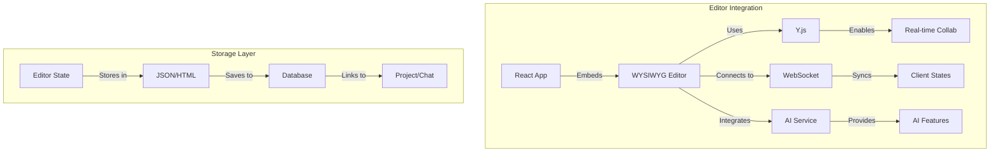
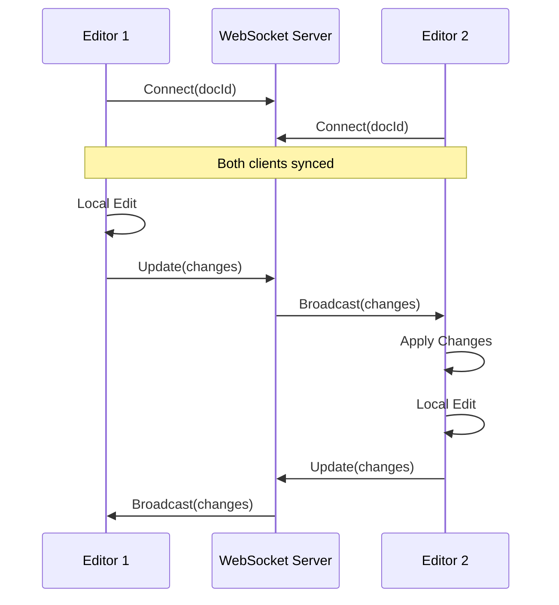
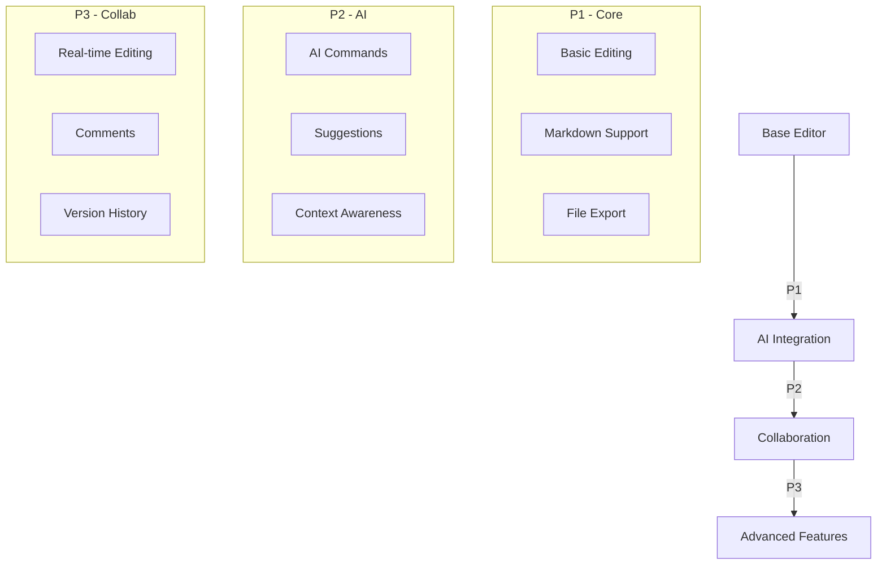

# 🎨 WYSIWYG Editor Libraries for BetterGPT

This document provides an overview of the best WYSIWYG React libraries suitable for our chat-first AI workspace, focusing on document editing, collaboration, and AI integration capabilities.

## 📊 Comparison Table

| Editor | Best For | BetterGPT Fit | Collaborative | AI Integration | File Support | Mermaid | Size (gzipped) | License | Key Features |
|--------|----------|---------------|---------------|----------------|--------------|---------|----------------|----------|--------------|
| TipTap | Document-first apps, Knowledge bases | 95% ⭐⭐⭐⭐⭐ | ✅ via Y.js | ✅ Extensible | MD, HTML, JSON | ✅ via ext | ~123KB | MIT | - ProseMirror-based<br>- Highly extensible<br>- Modern architecture<br>- Headless (fully customizable) |
| Remirror | Technical docs, API documentation | 85% ⭐⭐⭐⭐ | ✅ via Y.js | ✅ via ext | MD, HTML, Doc | ✅ Built-in | ~150KB | MIT | - ProseMirror-based<br>- TypeScript-first<br>- Extension system<br>- Markdown support |
| Lexical | Social platforms, Short-form content | 75% ⭐⭐⭐ | ✅ via Y.js | ✅ Built-in | MD, HTML | ✅ via plugin | ~30KB | MIT | - By Meta/Facebook<br>- Accessibility focused<br>- Real-time collab<br>- Tree-spliceable |
| Slate.js | Custom editors, Simple docs | 70% ⭐⭐⭐ | ✅ via Y.js | ✅ Extensible | Custom, MD, HTML | ✅ via plugin | ~50KB | MIT | - React-specific<br>- Plugin system<br>- Flexible schema<br>- Version control friendly |
| CKEditor 5 | Enterprise, Traditional WYSIWYG | 60% ⭐⭐ | ✅ Built-in | ✅ via API | Many formats | ✅ via plugin | ~230KB | Mixed | - Full-featured<br>- Enterprise-ready<br>- Extensive plugins<br>- Premium support |

## 🔄 Architecture Diagram



## 🤝 Y.js + WebSocket Deep Dive

### What is Y.js?

Y.js is a Conflict-free Replicated Data Type (CRDT) implementation that fundamentally changes how we handle state in collaborative web applications. Unlike traditional web collaboration that relies on a central server to resolve conflicts, Y.js provides a distributed approach that makes real-time collaboration more robust and efficient.

#### Traditional Web Collaboration vs Y.js

| Aspect | Traditional Web Apps | Y.js Approach |
|--------|---------------------|---------------|
| State Management | Central server holds "truth" | Each client has valid state |
| Conflict Resolution | Server decides winner | Automatic merge of all changes |
| Network Requirements | Constant connection needed | Works offline, syncs later |
| Scalability | Server becomes bottleneck | P2P reduces server load |
| Data Consistency | Can lose changes in conflicts | Never loses changes |

#### Key Benefits Over Traditional Web Apps:

1. **True Offline-First**
   - Traditional web apps require constant connection
   - Y.js allows full editing offline
   - Changes sync automatically when connection restores
   - No "lock" or "check-out" needed

2. **Smart Conflict Resolution**
   - Traditional: Last-write-wins or manual resolution
   - Y.js: Preserves intent of all changes
   - Example: Two users bold different parts of same text
   - Both changes preserved without conflicts

3. **Efficient Data Types**
   ```typescript
   const ydoc = new Y.Doc()
   
   // Shared text with formatting
   const ytext = ydoc.getText('editor')
   ytext.insert(0, 'Hello ')
   ytext.format(0, 5, { bold: true })
   
   // Shared metadata
   const ymap = ydoc.getMap('metadata')
   ymap.set('lastEdit', new Date())
   
   // Shared structured data
   const yarray = ydoc.getArray('blocks')
   yarray.push([{ type: 'paragraph', content: 'New block' }])
   ```

4. **Memory and Performance**
   - Traditional: Full document sent each time
   - Y.js: Only sends changes (deltas)
   - Efficient encoding of changes
   - Smaller network payload

### WebSocket Integration



### Implementation Example

```typescript
// server/src/websocket/document-sync.ts
import { WebSocketServer } from 'ws'
import * as awarenessProtocol from 'y-protocols/awareness'
import * as syncProtocol from 'y-protocols/sync'

const wss = new WebSocketServer({ port: 1234 })
const docs = new Map()

wss.on('connection', (conn, req) => {
  // Get document ID from URL
  const docId = new URL(req.url, 'ws://x').searchParams.get('doc')
  let doc = docs.get(docId)
  
  if (!doc) {
    doc = new Y.Doc()
    docs.set(docId, doc)
  }

  // Set up awareness (cursor positions, user info)
  const awareness = new awarenessProtocol.Awareness(doc)
  
  // Sync document changes
  conn.on('message', (message) => {
    syncProtocol.applyUpdate(doc, message)
    // Broadcast to other clients
    wss.clients.forEach(client => {
      if (client !== conn && client.readyState === WebSocket.OPEN) {
        client.send(message)
      }
    })
  })
})
```

### Client Integration with TipTap

```typescript
// client/src/components/Editor.tsx
import { WebsocketProvider } from 'y-websocket'
import { useEditor, EditorContent } from '@tiptap/react'
import Collaboration from '@tiptap/extension-collaboration'
import CollaborationCursor from '@tiptap/extension-collaboration-cursor'

const Editor = ({ docId, user }) => {
  const ydoc = new Y.Doc()
  
  // Connect to WebSocket server
  const provider = new WebsocketProvider(
    'ws://localhost:1234',
    docId,
    ydoc
  )
  
  // Set up editor with collaboration
  const editor = useEditor({
    extensions: [
      StarterKit,
      Collaboration.configure({
        document: ydoc,
      }),
      CollaborationCursor.configure({
        provider,
        user: {
          name: user.name,
          color: user.color,
        },
      }),
    ],
  })

  return <EditorContent editor={editor} />
}
```

### Y.js Benefits for BetterGPT

1. **Enhanced Document Reliability**
   - No data loss during network issues
   - Multiple users can edit same sections
   - Perfect for AI-assisted editing where both AI and user might edit simultaneously
   - Handles complex nested document structures

2. **Performance at Scale**
   - Peer-to-peer reduces server load
   - Only transmits changes, not full documents
   - Efficient for large documents with many editors
   - Binary encoding reduces network traffic

3. **Rich Collaboration Features**
   - Real-time cursor presence
   - User awareness and activity tracking
   - Live updates without refreshing
   - Collaborative annotations and comments

4. **Advanced Data Structures**
   ```typescript
   // Example: Complex document structure with Y.js
   const ydoc = new Y.Doc()
   
   // Main document content
   const content = ydoc.getText('content')
   
   // Separate layer for AI suggestions
   const aiSuggestions = ydoc.getMap('ai-suggestions')
   
   // User annotations
   const annotations = ydoc.getArray('annotations')
   
   // Document metadata
   const metadata = ydoc.getMap('metadata')
   metadata.set('version', 1)
   metadata.set('lastAIEdit', { timestamp: Date.now(), model: 'gpt-4' })
   
   // Observe changes
   content.observe(event => {
     // React to document changes
     console.log('Document updated:', event.changes)
   })
   
   aiSuggestions.observe(event => {
     // Handle new AI suggestions
     console.log('New AI suggestion:', event.changes)
   })
   ```

5. **Perfect for AI Integration**
   - Separate layers for user and AI content
   - No conflicts between AI and user edits
   - Track AI-generated vs user content
   - Real-time AI suggestions without blocking

## 🎯 Editor Rankings for BetterGPT

### 1. TipTap (95% Match)
- Perfect for document-centric workflows
- Strong TypeScript support
- Excellent Y.js integration
- Highly extensible for AI features
- Active community and development

### 2. Remirror (85% Match)
- Built for technical documentation
- Native Mermaid support
- Good TypeScript integration
- Slightly more complex setup
- Less active community than TipTap

### 3. Lexical (75% Match)
- Modern architecture
- Good performance
- Limited plugin ecosystem
- Less document-centric
- Newer, less mature

### 4. Slate.js (70% Match)
- Very flexible
- Good for custom features
- Steeper learning curve
- Less stable API
- Smaller ecosystem

### 5. CKEditor 5 (60% Match)
- Enterprise features we don't need
- Larger bundle size
- Less flexible for AI integration
- Commercial licensing concerns
- Overkill for our use case

## 💡 Recommended Choice: TipTap

For BetterGPT's requirements, **TipTap** stands out as the optimal choice for the following reasons:

### ✅ Key Advantages

1. **Document-First Architecture**
   - Perfect for our `/new-doc` command feature
   - Handles long-form content efficiently
   - Strong markdown support

2. **AI Integration Capabilities**
   - Easy to extend for AI suggestions
   - Custom commands for AI interactions
   - Clean content extraction for AI processing

3. **Collaboration Features**
   - Y.js integration for real-time collab
   - Cursor presence
   - Version history support

4. **Project Integration**
```typescript
// Example TipTap Integration
import { useEditor, EditorContent } from '@tiptap/react'
import StarterKit from '@tiptap/starter-kit'
import Collaboration from '@tiptap/extension-collaboration'
import * as Y from 'yjs'

const doc = new Y.Doc()

const Editor = () => {
  const editor = useEditor({
    extensions: [
      StarterKit,
      Collaboration.configure({
        document: doc,
      }),
      // Custom AI command extension
      AICommands.configure({
        endpoint: '/api/ai/suggest'
      })
    ],
    content: '<p>Start typing...</p>'
  })

  return <EditorContent editor={editor} />
}
```

## 🔧 Implementation Strategy

1. **Base Setup**
   - Install TipTap with collaborative features
   - Set up Y.js WebSocket provider
   - Implement basic editor commands

2. **AI Integration**
   - Create custom extensions for AI commands
   - Integrate with OpenAI API
   - Add suggestion handling

3. **Project Integration**
   - Link editor state to project docs
   - Implement file export/import
   - Add version control

4. **Collaboration Features**
   - Set up real-time editing
   - Add user presence
   - Implement commenting system

## 🎯 Feature Implementation Priority



## 📦 Required Dependencies

```json
{
  "dependencies": {
    "@tiptap/react": "^2.1.0",
    "@tiptap/starter-kit": "^2.1.0",
    "@tiptap/extension-collaboration": "^2.1.0",
    "@tiptap/extension-collaboration-cursor": "^2.1.0",
    "yjs": "^13.6.0",
    "y-websocket": "^1.5.0"
  }
}
``` 