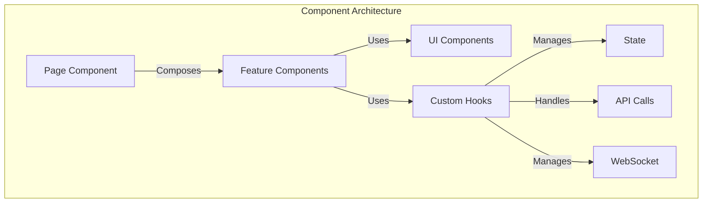
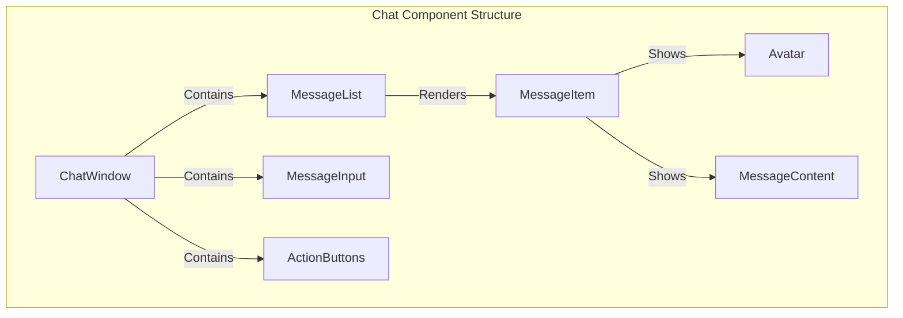
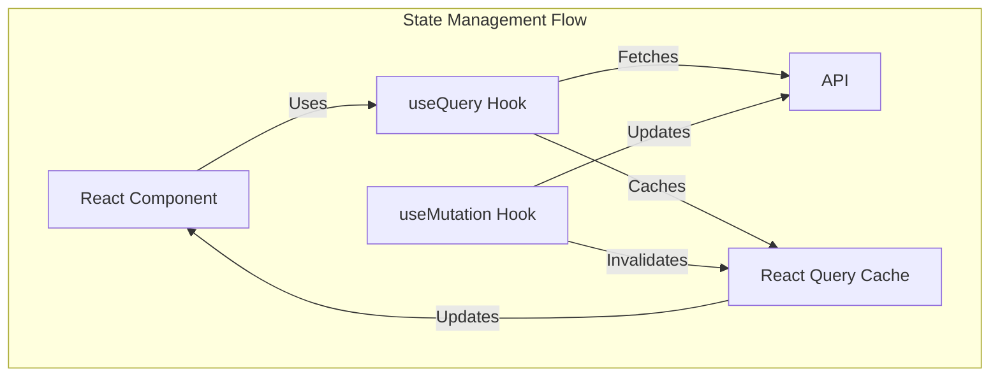
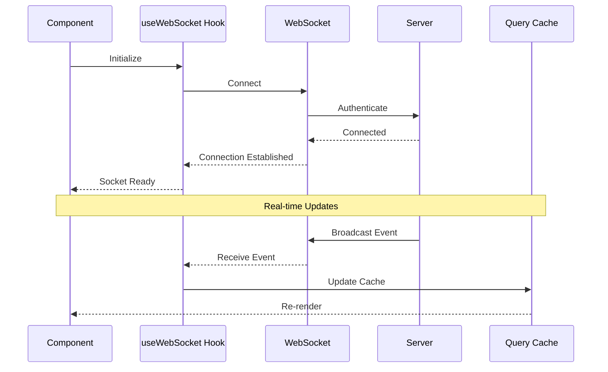
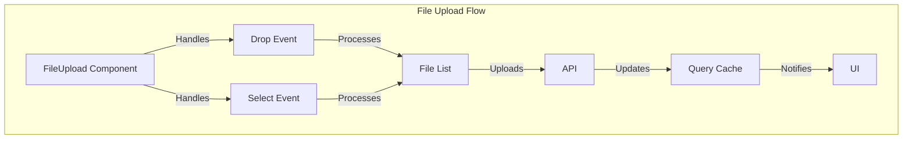
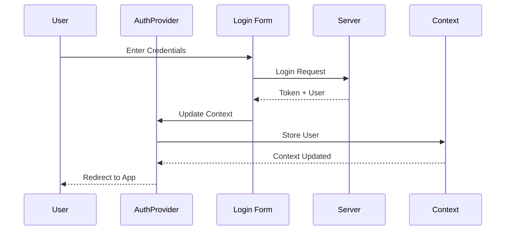
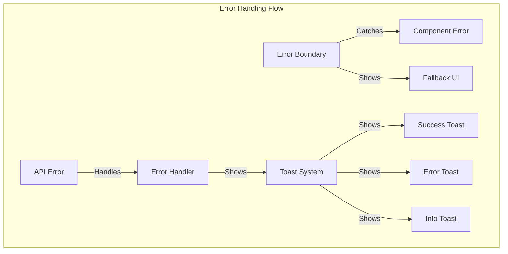
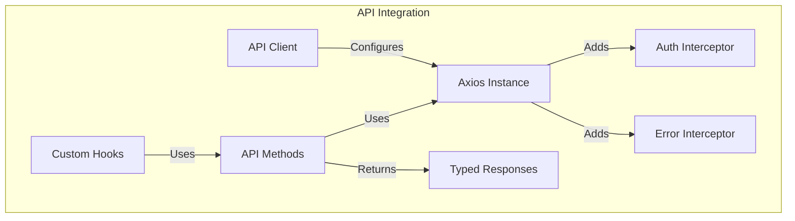
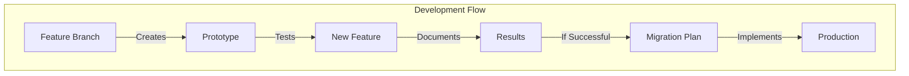

# 💻 Frontend Development Guide

This guide provides comprehensive best practices and structural guidelines for building robust, performant, and maintainable frontend components in our React + TypeScript + TailwindCSS application.

## 🔄 Component Architecture Overview



---

## 📌 Component Architecture

### ✅ Core Component Structure



```typescript
// client/src/components/chat/ChatWindow.tsx
import { useChat } from '@/hooks/useChat';
import { MessageList } from './MessageList';
import { MessageInput } from './MessageInput';
import { ActionButtons } from './ActionButtons';

export function ChatWindow() {
  const { messages, sendMessage, isLoading } = useChat();
  
  return (
    <div className="flex flex-col h-full">
      <MessageList messages={messages} />
      <div className="border-t p-4">
        <MessageInput onSend={sendMessage} />
        <ActionButtons />
      </div>
    </div>
  );
}

// client/src/components/chat/MessageList.tsx
export function MessageList({ messages }: MessageListProps) {
  return (
    <div className="flex-1 overflow-y-auto p-4 space-y-4">
      {messages.map((message) => (
        <MessageItem key={message.id} message={message} />
      ))}
    </div>
  );
}

// client/src/components/chat/MessageItem.tsx
export function MessageItem({ message }: MessageItemProps) {
  return (
    <div className="flex items-start space-x-3">
      <Avatar user={message.user} />
      <div className="flex-1">
        <div className="flex items-center space-x-2">
          <span className="font-medium">{message.user.name}</span>
          <span className="text-sm text-gray-500">
            {formatDate(message.createdAt)}
          </span>
        </div>
        <div className="mt-1 prose">
          <MessageContent content={message.content} />
        </div>
      </div>
    </div>
  );
}
```

---

## 📌 State Management with React Query

### ✅ Query Client Configuration



```typescript
// client/src/lib/queryClient.ts
import { QueryClient } from '@tanstack/react-query';

export const queryClient = new QueryClient({
  defaultOptions: {
    queries: {
      staleTime: 1000 * 60 * 5, // 5 minutes
      cacheTime: 1000 * 60 * 30, // 30 minutes
      retry: 3,
      retryDelay: (attemptIndex) => Math.min(1000 * 2 ** attemptIndex, 30000),
    },
  },
});

// client/src/hooks/useChat.ts
export function useChat(chatId: string) {
  const { data: messages, isLoading } = useQuery({
    queryKey: ['messages', chatId],
    queryFn: () => api.getMessages(chatId),
  });

  const { mutate: sendMessage } = useMutation({
    mutationFn: (content: string) => api.sendMessage(chatId, content),
    onSuccess: () => {
      queryClient.invalidateQueries(['messages', chatId]);
    },
  });

  return { messages, isLoading, sendMessage };
}
```

---

## 📌 Real-time Updates with WebSocket

### ✅ WebSocket Integration



```typescript
// client/src/hooks/useWebSocket.ts
export function useWebSocket() {
  const [socket, setSocket] = useState<WebSocket | null>(null);

  useEffect(() => {
    const ws = new WebSocket(WS_URL);
    
    ws.onmessage = (event) => {
      const { type, data } = JSON.parse(event.data);
      switch (type) {
        case 'message:created':
          queryClient.setQueryData(
            ['messages', data.chatId],
            (old: Message[]) => [...old, data]
          );
          break;
        case 'chat:updated':
          queryClient.invalidateQueries(['chats']);
          break;
      }
    };

    setSocket(ws);
    return () => ws.close();
  }, []);

  return socket;
}

// client/src/components/chat/ChatWindow.tsx
export function ChatWindow() {
  const socket = useWebSocket();
  // ... rest of the component
}
```

---

## 📌 File Upload Handling

### ✅ File Upload Component



```typescript
// client/src/components/chat/FileUpload.tsx
export function FileUpload() {
  const { mutate: uploadFile, isLoading } = useMutation({
    mutationFn: (file: File) => {
      const formData = new FormData();
      formData.append('file', file);
      return api.uploadFile(formData);
    },
    onSuccess: (data) => {
      queryClient.invalidateQueries(['files']);
      toast.success('File uploaded successfully');
    },
  });

  const handleDrop = useCallback((files: File[]) => {
    files.forEach(uploadFile);
  }, [uploadFile]);

  return (
    <div
      className="border-2 border-dashed rounded-lg p-4"
      onDrop={(e) => {
        e.preventDefault();
        handleDrop(Array.from(e.dataTransfer.files));
      }}
    >
      <input
        type="file"
        onChange={(e) => e.target.files && handleDrop(Array.from(e.target.files))}
        className="hidden"
      />
      <div className="text-center">
        <p>Drop files here or click to upload</p>
      </div>
    </div>
  );
}
```

---

## 📌 Authentication Flow

### ✅ Auth Context and Hooks



```typescript
// client/src/contexts/AuthContext.tsx
export function AuthProvider({ children }: { children: React.ReactNode }) {
  const [user, setUser] = useState<User | null>(null);
  const [isLoading, setIsLoading] = useState(true);

  useEffect(() => {
    checkAuth();
  }, []);

  const checkAuth = async () => {
    try {
      const user = await api.getCurrentUser();
      setUser(user);
    } catch {
      setUser(null);
    } finally {
      setIsLoading(false);
    }
  };

  const login = async (credentials: Credentials) => {
    const { user, token } = await api.login(credentials);
    localStorage.setItem('token', token);
    setUser(user);
  };

  const logout = () => {
    localStorage.removeItem('token');
    setUser(null);
  };

  return (
    <AuthContext.Provider value={{ user, isLoading, login, logout }}>
      {children}
    </AuthContext.Provider>
  );
}

// client/src/hooks/useAuth.ts
export function useAuth() {
  const context = useContext(AuthContext);
  if (!context) {
    throw new Error('useAuth must be used within AuthProvider');
  }
  return context;
}
```

---

## 📌 Error Handling

### ✅ Error Boundaries and Toast Notifications



```typescript
// client/src/components/ErrorBoundary.tsx
export class ErrorBoundary extends React.Component<
  { children: React.ReactNode },
  { hasError: boolean }
> {
  state = { hasError: false };

  static getDerivedStateFromError() {
    return { hasError: true };
  }

  render() {
    if (this.state.hasError) {
      return (
        <div className="p-4 bg-red-50 text-red-700 rounded-lg">
          <h2 className="text-lg font-semibold">Something went wrong</h2>
          <button
            onClick={() => this.setState({ hasError: false })}
            className="mt-2 text-sm underline"
          >
            Try again
          </button>
        </div>
      );
    }

    return this.props.children;
  }
}

// client/src/components/ToastNotifications.tsx
export function ToastNotifications() {
  const { toasts, removeToast } = useToast();

  return (
    <div className="fixed bottom-4 right-4 space-y-2">
      {toasts.map((toast) => (
        <div
          key={toast.id}
          className={`p-4 rounded-lg shadow-lg ${
            toast.type === 'error' ? 'bg-red-500' : 'bg-green-500'
          } text-white`}
        >
          {toast.message}
          <button
            onClick={() => removeToast(toast.id)}
            className="ml-2 text-sm underline"
          >
            Dismiss
          </button>
        </div>
      ))}
    </div>
  );
}
```

---

## 📌 API Integration

### ✅ API Client Setup



```typescript
// client/src/lib/api.ts
import axios from 'axios';

const api = axios.create({
  baseURL: import.meta.env.VITE_API_URL,
});

api.interceptors.request.use((config) => {
  const token = localStorage.getItem('token');
  if (token) {
    config.headers.Authorization = `Bearer ${token}`;
  }
  return config;
});

api.interceptors.response.use(
  (response) => response.data,
  (error) => {
    if (error.response?.status === 401) {
      // Handle unauthorized
      window.location.href = '/login';
    }
    return Promise.reject(error);
  }
);

export const chatApi = {
  getMessages: (chatId: string) => api.get(`/chats/${chatId}/messages`),
  sendMessage: (chatId: string, content: string) =>
    api.post(`/chats/${chatId}/messages`, { content }),
  uploadFile: (formData: FormData) =>
    api.post('/files/upload', formData, {
      headers: { 'Content-Type': 'multipart/form-data' },
    }),
};
```

---

## 📌 Development Playground Integration



```typescript
// dev-playground/components/NewFeature.tsx
export function NewFeature() {
  // Test implementation
  return (
    <div className="p-4 border rounded-lg">
      <h2>New Feature Prototype</h2>
      {/* Implementation */}
    </div>
  );
}
```

---

## 🚀 Next Steps

1. **Implementation**
   - Set up component structure
   - Configure React Query
   - Implement WebSocket integration

2. **Testing**
   - Unit tests for components
   - Integration tests for hooks
   - E2E testing with Cypress

3. **Documentation**
   - Component documentation
   - Hook usage examples
   - Development playground guides

Would you like me to elaborate on any part of this structure or show more detailed implementation examples? 