# 💻 Frontend Responsibilities Guide

This guide details frontend responsibilities, outlining primary files, interactions, state management, and integration points with our backend services.

## 🔄 Frontend Architecture Overview

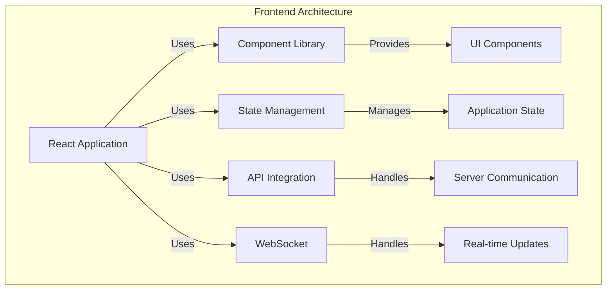

## ✅ Frontend Responsibilities Overview

Our frontend (built with **Vite + React + TypeScript + TailwindCSS**) manages the following critical tasks:

* **User Interface & Interaction** (chat UI, slash commands, navigation)
* **State & Data Management** (React-Query caching, global state)
* **API Integration** (via REST API endpoints & hooks)
* **Authentication Management** (JWT & OAuth via hooks)
* **Real-time Updates Handling** (WebSockets integration)
* **File Upload Interface & Management** (frontend upload logic)
* **Error Handling & User Feedback** (toast notifications, validations)

## 📂 Core Frontend Structure

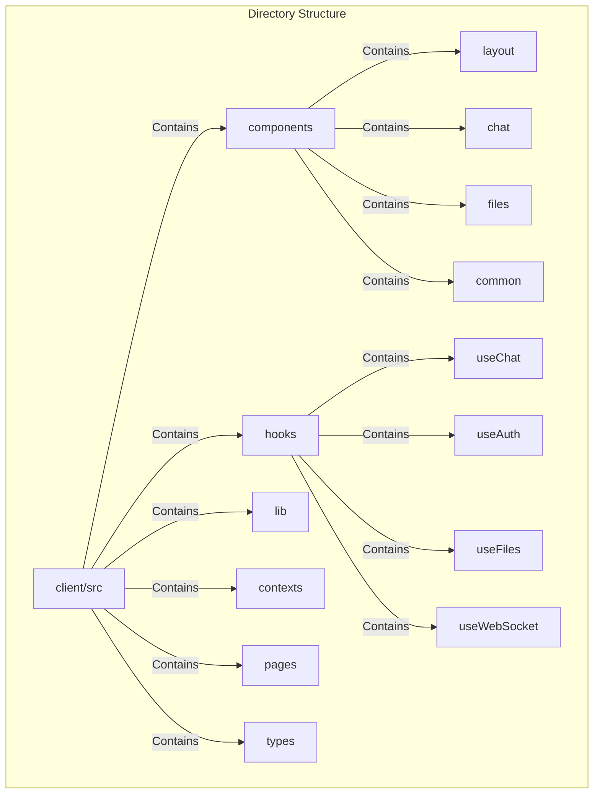

```
client/
├── src/
│   ├── components/
│   │   ├── layout/
│   │   │   ├── Header.tsx
│   │   │   ├── Sidebar.tsx
│   │   │   └── MainLayout.tsx
│   │   ├── chat/
│   │   │   ├── ChatWindow.tsx
│   │   │   ├── MessageList.tsx
│   │   │   ├── MessageItem.tsx
│   │   │   ├── MessageInput.tsx
│   │   │   └── ActionButtons.tsx
│   │   ├── files/
│   │   │   ├── FileUpload.tsx
│   │   │   ├── FileList.tsx
│   │   │   └── FilePreview.tsx
│   │   └── common/
│   │       ├── Button.tsx
│   │       ├── Input.tsx
│   │       └── Toast.tsx
│   ├── hooks/
│   │   ├── useChat.ts
│   │   ├── useAuth.ts
│   │   ├── useFiles.ts
│   │   └── useWebSocket.ts
│   ├── lib/
│   │   ├── api.ts
│   │   ├── queryClient.ts
│   │   └── websocket.ts
│   ├── contexts/
│   │   ├── AuthContext.tsx
│   │   └── ToastContext.tsx
│   ├── pages/
│   │   ├── chat/
│   │   │   ├── index.tsx
│   │   │   └── [id].tsx
│   │   ├── files/
│   │   │   └── index.tsx
│   │   └── auth/
│   │       ├── login.tsx
│   │       └── register.tsx
│   └── types/
│       ├── chat.ts
│       ├── file.ts
│       └── user.ts
```

## ⚙️ Detailed Frontend Responsibilities

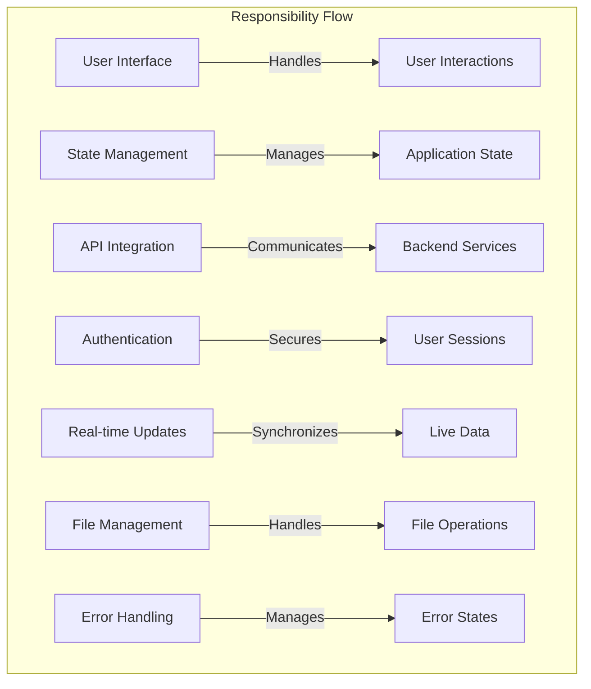

| Responsibility                         | Implementation Details                                    | Key Components                                    |
| -------------------------------------- | --------------------------------------------------------- | ------------------------------------------------- |
| **User Interface & Interaction**       | Chat UI, navigation, slash-commands                       | `ChatWindow.tsx`, `MessageInput.tsx`              |
| **State & Data Management**            | React-Query caching, global state                         | `queryClient.ts`, custom hooks                    |
| **API Integration**                    | REST API communication                                    | `api.ts`, `useChat.ts`                           |
| **Authentication**                     | JWT & OAuth management                                    | `AuthContext.tsx`, `useAuth.ts`                   |
| **Real-time Updates**                  | WebSocket integration                                     | `useWebSocket.ts`, `websocket.ts`                 |
| **File Management**                    | Upload, preview, organization                             | `FileUpload.tsx`, `FileList.tsx`                  |
| **Error Handling**                     | Toast notifications, error boundaries                     | `Toast.tsx`, `ErrorBoundary.tsx`                  |

## 🔄 Data Flow Architecture

### ✅ Component to Service Flow

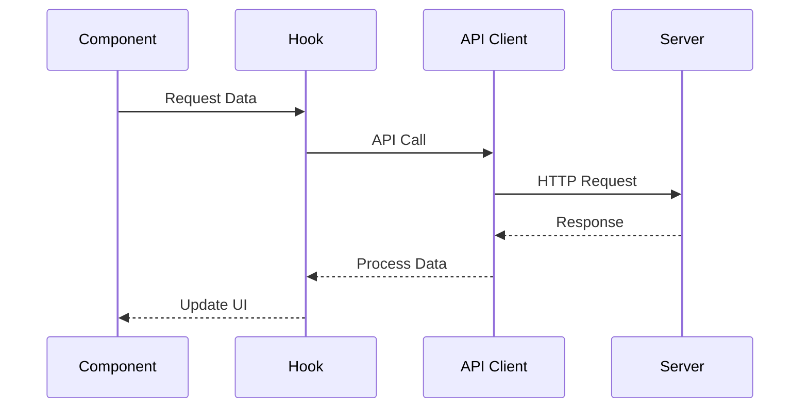

### ✅ Real-time Update Flow

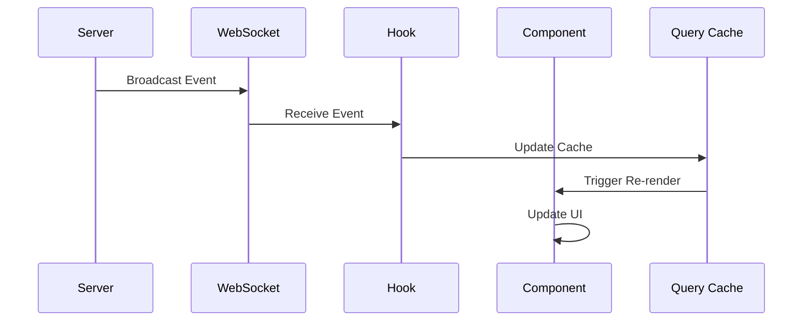

## 📌 Key Implementation Patterns

### ✅ Component Pattern

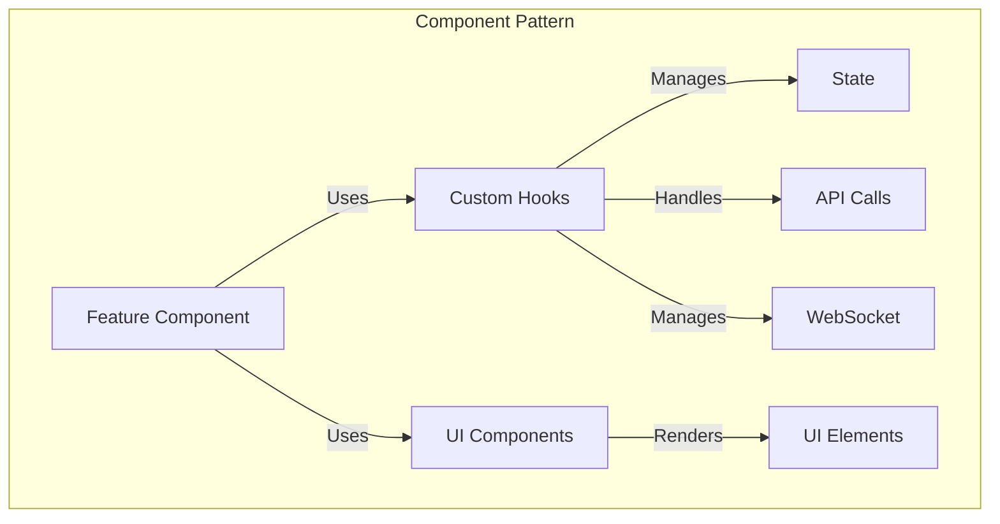

```typescript
// Example of a feature component
export function ChatFeature() {
  // Data fetching
  const { data, isLoading } = useQuery(...);
  
  // Real-time updates
  const socket = useWebSocket();
  
  // User interactions
  const { mutate } = useMutation(...);
  
  // Error handling
  const { toast } = useToast();
  
  return (
    <ErrorBoundary>
      {isLoading ? (
        <LoadingSpinner />
      ) : (
        <div className="space-y-4">
          <ChatList data={data} />
          <ChatInput onSubmit={mutate} />
        </div>
      )}
    </ErrorBoundary>
  );
}
```

### ✅ Hook Pattern

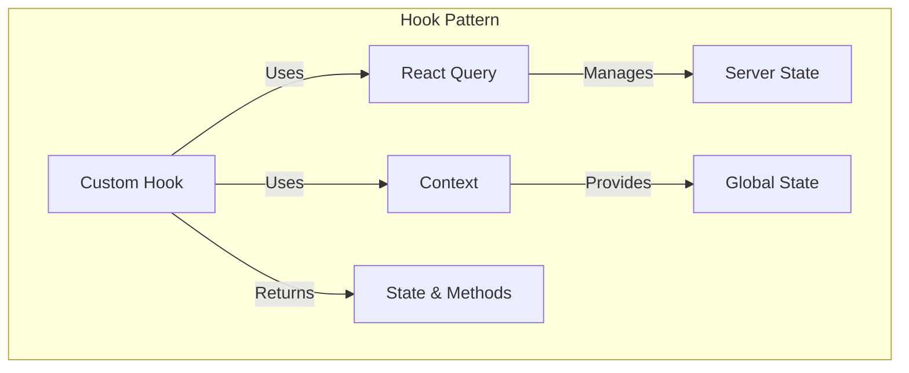

```typescript
// Example of a custom hook
export function useChatFeature() {
  const queryClient = useQueryClient();
  const { toast } = useToast();
  
  const query = useQuery({
    queryKey: ['chat'],
    queryFn: () => api.getChat(),
  });
  
  const mutation = useMutation({
    mutationFn: (data) => api.updateChat(data),
    onSuccess: () => {
      queryClient.invalidateQueries(['chat']);
      toast.success('Chat updated');
    },
  });
  
  return {
    data: query.data,
    isLoading: query.isLoading,
    update: mutation.mutate,
  };
}
```

## 🎨 UI Component Library

### ✅ Base Components

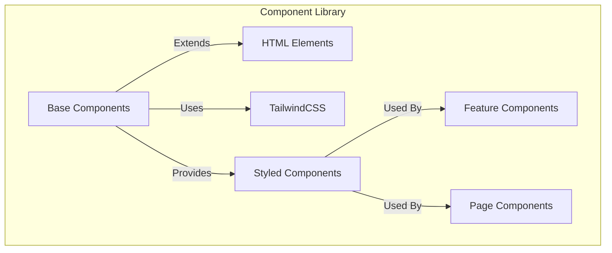

```typescript
// Example of a reusable button component
export function Button({
  variant = 'primary',
  size = 'md',
  children,
  ...props
}: ButtonProps) {
  return (
    <button
      className={cn(
        'rounded-lg font-medium transition-colors',
        {
          'bg-blue-500 text-white hover:bg-blue-600': variant === 'primary',
          'bg-gray-100 text-gray-900 hover:bg-gray-200': variant === 'secondary',
        },
        {
          'px-4 py-2 text-sm': size === 'sm',
          'px-6 py-3 text-base': size === 'md',
          'px-8 py-4 text-lg': size === 'lg',
        }
      )}
      {...props}
    >
      {children}
    </button>
  );
}
```

## 🔒 Security Considerations

### ✅ Authentication Flow

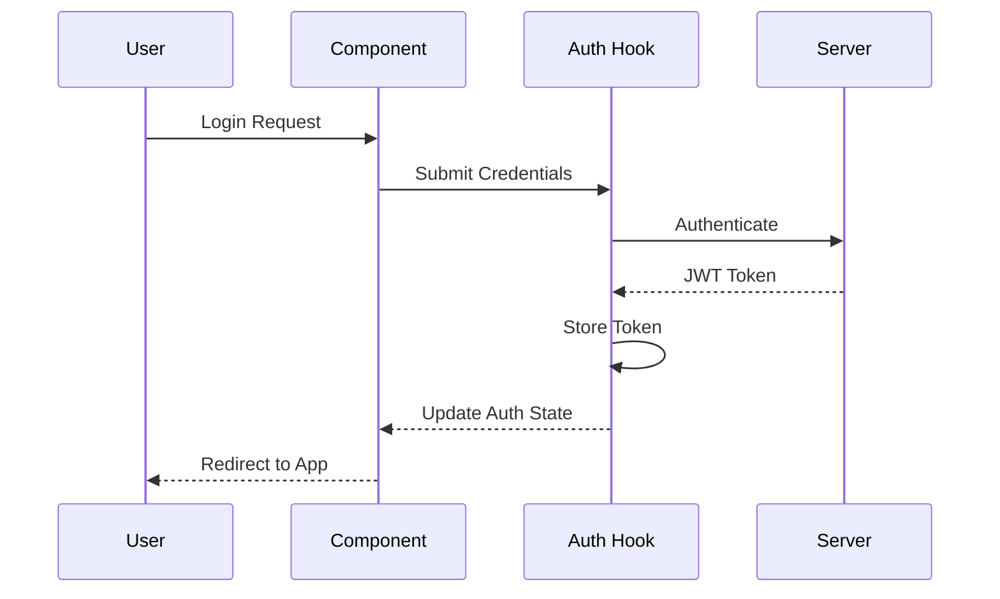

```typescript
// Protected route wrapper
export function ProtectedRoute({ children }: { children: React.ReactNode }) {
  const { user, isLoading } = useAuth();
  const router = useRouter();

  useEffect(() => {
    if (!isLoading && !user) {
      router.push('/login');
    }
  }, [user, isLoading, router]);

  if (isLoading) {
    return <LoadingSpinner />;
  }

  return user ? <>{children}</> : null;
}
```

## 📱 Responsive Design

### ✅ TailwindCSS Breakpoints

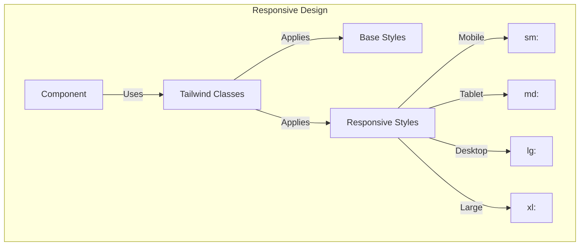

```typescript
// Example of responsive component
export function ResponsiveLayout() {
  return (
    <div className="
      grid
      grid-cols-1
      md:grid-cols-2
      lg:grid-cols-3
      gap-4
      p-4
    ">
      <Sidebar className="hidden md:block" />
      <MainContent />
      <ChatWindow className="hidden lg:block" />
    </div>
  );
}
```

## 🎮 Development Playground

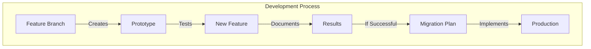

```typescript
// dev-playground/README.md
# Frontend Development Playground

This directory contains experimental frontend features and prototypes.

## Structure
- `/components` - New UI components
- `/hooks` - Custom hook experiments
- `/pages` - Page prototypes
- `/styles` - Style experiments

## Usage
1. Create feature branch
2. Implement prototype
3. Document results
4. Create migration plan if successful
```

## 🚀 Next Steps

1. **Implementation**
   - Set up component library
   - Configure state management
   - Implement real-time features

2. **Testing**
   - Unit tests for components
   - Integration tests for hooks
   - E2E testing with Cypress

3. **Documentation**
   - Component documentation
   - Hook usage examples
   - Development playground guides

Would you like me to elaborate on any part of this structure or show more detailed implementation examples? 