# 🌟 BetterGPT - Project Overview & PRD

This document outlines the architecture for BetterGPT, a chat-first AI workspace with document storage, navigation, and collaboration features. The architecture is optimized for direct implementation while maintaining a development playground for future agent-based features.

## 📁 Project Structure

```text
better-gpt/
├── client/                # Vite + React (AI-chat-first UI)
│   ├── Dockerfile
│   ├── package.json
│   └── src/
│       ├── components/
│       │   ├── layout/
│       │   ├── chat/
│       │   │   ├── ChatWindow.tsx        # Thread pane w/ file previews
│       │   │   ├── MessageInput.tsx      # Slash-commands, prompt helpers
│       │   │   ├── ActionButtons.tsx     # "/new-doc", "/summarise" …
│       │   │   └── index.ts
│       ├── hooks/
│       │   ├── useChatApi.ts             # Direct API integration
│       │   ├── usePageContent.ts
│       │   ├── useAuth.ts
│       ├── lib/
│       │   ├── queryClient.ts            # React-Query
│       │   ├── utils.ts
│       │   ├── api.ts                    # REST helpers
│       │   ├── auth.ts
│       ├── pages/
│       │   ├── chat.tsx                  # Primary screen
│       │   ├── feature-support.tsx       # Docs on slash-commands / tips
│       │   ├── login.tsx
│       │   ├── register.tsx
│       │   └── …
│       ├── App.tsx
│       └── main.tsx
│   └── public/
├── server/                # Express + WS + Drizzle
│   ├── Dockerfile
│   ├── index.ts
│   ├── routes.ts          # API endpoints
│   ├── services/          # Core service implementations
│   │   ├── ai.ts         # OpenAI integration
│   │   ├── files.ts      # File processing & storage
│   │   ├── notifications.ts  # Slack/Email integration
│   │   └── scheduler.ts  # Cron jobs & scheduled tasks
│   ├── storage.ts        # S3 management, quotas
│   ├── db.ts             # Postgres via Drizzle
│   ├── auth/             # JWT, OAuth integration
│   ├── middlewares.ts    # Security, middleware handlers
│   └── vite.ts
├── dev-playground/       # n8n development playground
│   ├── Dockerfile
│   └── README.md         # Clear documentation of playground purpose
├── infra/               # Docker Compose, IaC setups
│   ├── docker-compose.yml
│   └── .env
├── shared/              # Unified Drizzle/Zod schemas
│   └── schema.ts
├── docs/
│   ├── app-overview-prd.md
│   └── architecture/
└── …
```

## 🔄 System Architecture Flow


## 1. Vision & Positioning

| Topic                      | Statement                                                                                                                                                                                                                                                  |
| -------------------------- | ---------------------------------------------------------------------------------------------------------------------------------------------------------------------------------------------------------------------------------------------------------- |
| **Core Idea**              | *Chat-first* AI workspace where every prompt, reply, and generated asset becomes a **first-class, navigable document**—not an ephemeral chat scroll.                                                                                                       |
| **Primary Users**          | • **Developers & dev-learners** doing research, RFCs, snippets  • **Technical writers / researchers** compiling large knowledge bases  • **Power users** who hate losing AI context.                                                                       |
| **Key Pain Points Solved** | 1. Traditional chat (ChatGPT) makes file output painful to retrieve. 2. Context history is hard to curate. 3. Collaboration on prompts / results requires copy-paste.                                                                                      |
| **Differentiators**        | • "**/**" **slash-commands** create full docs, code snippets, tasks  • **File sidebar** & **favorites** directly inside chat thread  • Built-in **project switcher** + file move  • Direct service integrations for AI, storage, and notifications. |

## 2. Functional Pillars

### 2.1 Conversational AI Engine


* GPT-4 (default) via direct OpenAI integration
* Chat history cached in Redis per-thread (20-message sliding window)
* Slash-command parser (`/new-doc`, `/outline`, `/summarise`, `/thumb`) handled in **ActionButtons.tsx** + server route `/chat/command`

### 2.2 File & Document Layer


* Every AI-generated markdown / Tiptap JSON stored in `project_docs`
* **Move / copy** across projects via drag-drop; Slack notify via direct integration
* Stars, follows, version history (90-day retention)
* Image uploads create auto-thumbnails through direct Sharp processing

### 2.3 Navigation & Search


* Global fuzzy search (users, files, chat threads) under `Ctrl+K`
* Direct pgvector + embeddings for semantic "Ask the Project" queries
* **Favorites view**, **Recent AI**, **Digest email** Monday summary

### 2.4 Collaboration & Permissions


* Roles: **owner / editor / viewer** at project level
* Real-time WS events: `chat.message`, `doc.updated`, `file.moved`
* Follow a doc to get DM on moves or new AI versions

### 2.5 Development Playground (n8n)

The `dev-playground` directory serves as a development environment for:
* Prototyping new agent-based features
* Testing complex workflow ideas
* Experimenting with new integrations

**Important Notes:**
* Features developed here are temporary and for prototyping only
* No production features should depend on this playground
* All successful prototypes must be implemented directly in the main application
* Clear documentation required for any playground experiments

### 2.6 WYSIWYG Editor Integration (TipTap)


* **TipTap** chosen for document-first architecture and Y.js integration
* Real-time collaboration via WebSocket + Y.js CRDT
* Custom extensions for AI command integration
* Markdown import/export with full formatting support
* Version history and collaborative annotations

Key Editor Features:
* Slash-command integration (`/new-doc`, `/outline`)
* AI-assisted editing and suggestions
* Real-time cursor presence and user awareness
* Document versioning and change tracking
* Rich text formatting with markdown support

```typescript
// Example TipTap Integration in ChatWindow.tsx
const Editor = ({ docId, user }) => {
  const ydoc = new Y.Doc()
  const provider = new WebsocketProvider(
    'ws://localhost:1234',
    docId,
    ydoc
  )
  
  const editor = useEditor({
    extensions: [
      StarterKit,
      Collaboration.configure({
        document: ydoc,
      }),
      AICommands.configure({
        endpoint: '/api/ai/suggest'
      })
    ],
  })

  return <EditorContent editor={editor} />
}
```

Required Dependencies:
```json
{
  "dependencies": {
    "@tiptap/react": "^2.1.0",
    "@tiptap/starter-kit": "^2.1.0",
    "@tiptap/extension-collaboration": "^2.1.0",
    "@tiptap/extension-collaboration-cursor": "^2.1.0",
    "yjs": "^13.6.0",
    "y-websocket": "^1.5.0"
  }
}
```

### 2.7 Code Features & Monaco Integration


* **Monaco Editor** for advanced code editing and IntelliSense
* Semantic code search via pgvector embeddings
* Git integration for version control and review
* AI-powered code generation and review

Key Features:
* Language-aware code completion
* Symbol navigation and search
* Real-time error detection
* Git diff viewing and PR reviews
* AI-assisted code generation

```typescript
// Example Monaco Integration with TipTap
const CodeBlockWithMonaco = Extension.create({
  name: 'codeBlockMonaco',

  addOptions() {
    return {
      languageDetection: true,
      defaultLanguage: 'typescript'
    };
  },

  addNodeView() {
    return ({ node, getPos }) => {
      const dom = document.createElement('div');
      
      const editor = <MonacoEditorView
        height="200px"
        language={node.attrs.language}
        value={node.textContent}
        onChange={(value) => {
          // Update TipTap content
          const pos = getPos();
          const transaction = this.editor.state.tr.setNodeMarkup(
            pos,
            undefined,
            { ...node.attrs, content: value }
          );
          this.editor.view.dispatch(transaction);
        }}
        options={{
          minimap: { enabled: false },
          lineNumbers: 'on',
          scrollBeyondLastLine: false,
          automaticLayout: true
        }}
      />;

      return {
        dom,
        contentDOM: dom,
        ignoreMutation: () => true,
        update: (node) => {
          if (node.type.name !== 'codeBlockMonaco') return false;
          editor.setValue(node.textContent);
          return true;
        }
      };
    };
  }
});
```

Required Dependencies:
```json
{
  "dependencies": {
    "@monaco-editor/react": "^4.6.0",
    "monaco-editor": "^0.45.0",
    "simple-git": "^3.20.0",
    "@octokit/rest": "^19.0.0",
    "drizzle-orm": "^0.28.0",
    "@neondatabase/serverless": "^0.6.0"
  }
}
```

### 2.8 Semantic Code Search


* Semantic code search powered by pgvector
* Symbol extraction and indexing
* Context-aware search results
* Integration with OpenAI embeddings

```typescript
// Example Search Implementation
export class SearchService {
  private openai: OpenAIService;

  async searchCode(query: string): Promise<SearchResult[]> {
    const embedding = await this.openai.createEmbedding(query);
    
    return db
      .select({
        filePath: codeEmbeddings.filePath,
        symbolName: codeEmbeddings.symbolName,
        similarity: sql`1 - (embedding <=> ${embedding})`
      })
      .from(codeEmbeddings)
      .orderBy(sql`similarity DESC`)
      .limit(10);
  }
}
```

### 2.9 Version Control Integration


* Git operations via simple-git
* GitHub API integration via Octokit
* Pull request management and review
* Diff viewing with Monaco editor
* AI-powered commit suggestions

```typescript
// Example Git Integration
export class GitService {
  private git: SimpleGit;
  private octokit: Octokit;

  async reviewPullRequest(pr: number): Promise<void> {
    const changes = await this.getPRChanges(pr);
    const review = await this.ai.reviewCode(changes);
    
    await this.octokit.pulls.createReview({
      owner: this.owner,
      repo: this.repo,
      pull_number: pr,
      body: review.summary,
      comments: review.comments
    });
  }
}
```

## 3. Product Requirements (MVP)

| #  | Requirement                               | Acceptance Test                                                         |
| -- | ----------------------------------------- | ----------------------------------------------------------------------- |
| P1 | Chat window with slash-commands           | Typing `/new-doc Project Brief` creates a Tiptap doc linked in sidebar. |
| P2 | AI responses attach as doc or inline text | `mode=generate` returns doc link; editor opens in split pane.           |
| P3 | File move across projects                 | Drag file tile → new project; Slack messages in both channels.          |
| P4 | Search bar surfaces files + chat          | `invoice` returns ≤ 500 ms results list sorted by project.              |
| P5 | Weekly digest email                       | Monday 08:00 UTC email lists top 5 starred docs; open-rate tracked.     |
| P6 | Thumbnails for images                     | Upload PNG → 400-px JPEG thumb stored; appears in file card.            |

## 4. Non-Functional Targets

```mermaid
graph TD
    A[Performance] -->|Target| B[≤1s P95]
    A -->|Target| C[99.9% Uptime]
    D[Cost] -->|Target| E[<$0.002/req]
    F[Security] -->|Target| G[GDPR Compliant]
    H[Scalability] -->|Target| I[Auto-scaling]
```



| Dimension                 | Target                                                |
| ------------------------- | ----------------------------------------------------- |
| Latency (chat round-trip) | ≤ 1 s P95 (server→OpenAI→server)                      |
| AI cost ceiling           | <$0.002 per request average                          |
| File durability           | Primary S3 + daily Drive backup                       |
| Availability              | 99.9 % (excluding planned maintenance)               |
| Privacy                   | GDPR export/delete APIs; token logging off by default |

## 5. Release Timeline


| Phase     | Milestones                                         | ETA     |
| --------- | -------------------------------------------------- | ------- |
| **Alpha** | Core chat + `/summarise` + doc sidebar             | Month 1 |
| **Beta**  | Project roles, file move, Slack alerts, thumbnails | Month 2 |
| **GA**    | Embeddings search, weekly digests, quota & cleanup | Month 3 |

## 6. Open Questions

1. Will we support real-time multi-cursor for TipTap out of the box?
2. How granular should file permissions be (per-file vs project-wide)?
3. Preferred AI model fallbacks if GPT-4 budget exceeded?
4. How should we handle offline editing and sync conflicts?
5. What's the storage strategy for document version history?

## 7. Implementation Strategy


## Next Actions

* Review scope with engineering & design
* Finalize DB schema (`shared/schema.ts`)
* Spin up `infra/docker-compose.yml` with Postgres, Redis
* Set up development playground for future agent prototyping 