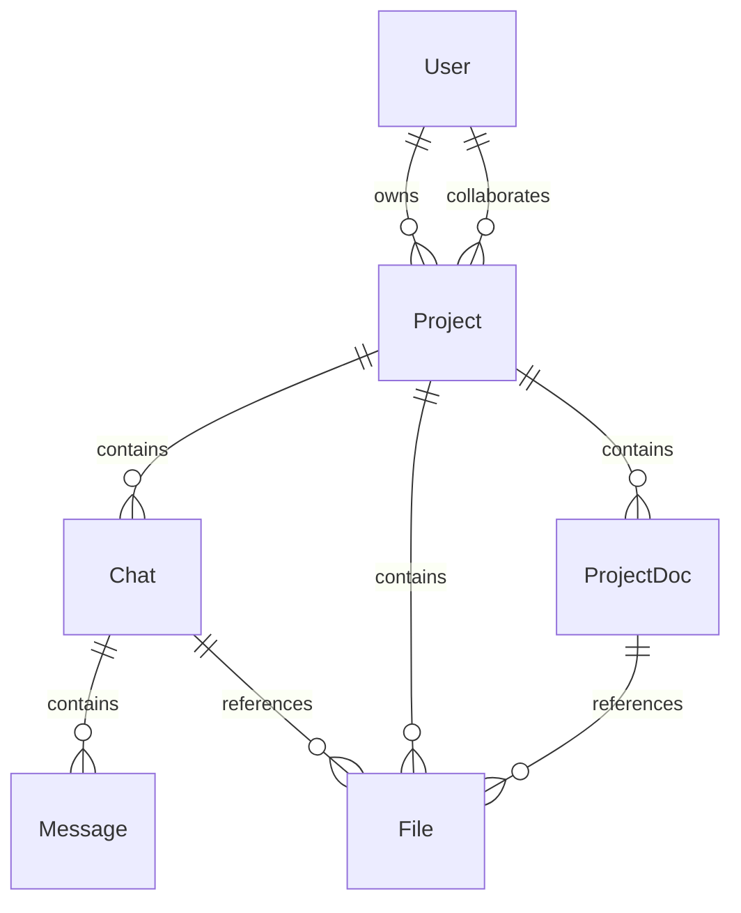
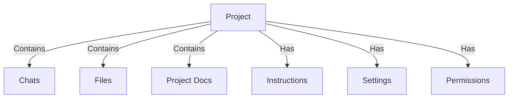
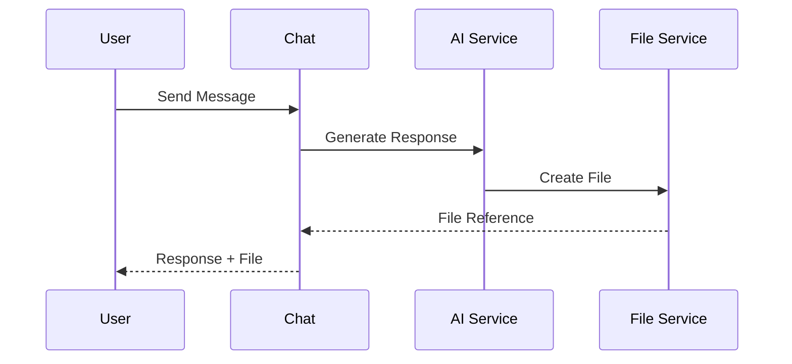
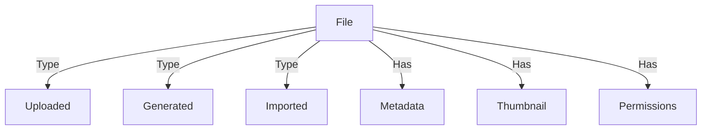
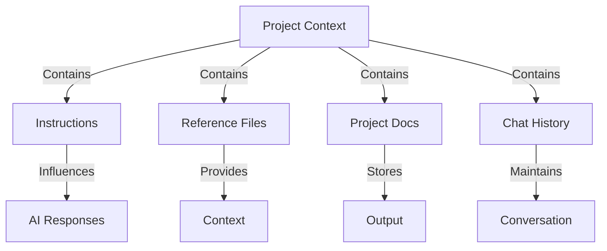
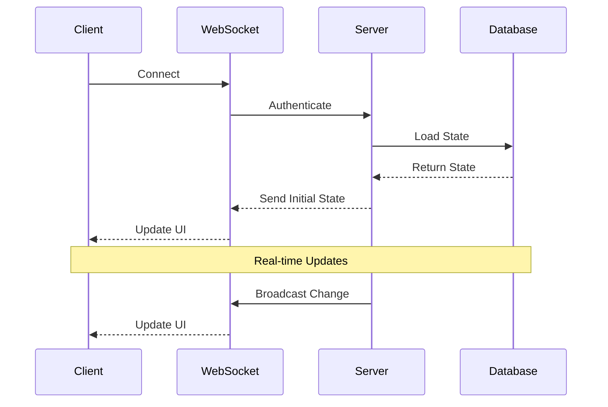
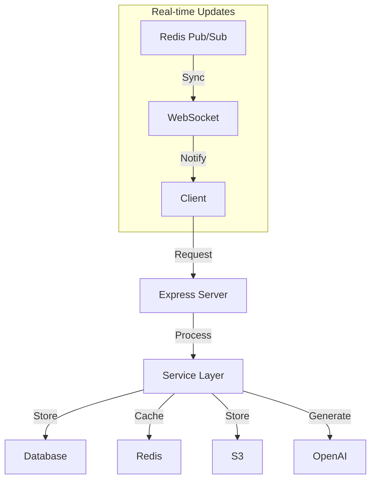

# 🌟 BetterGPT - Core Entity Structure

This document outlines the core data hierarchy and interaction model for BetterGPT, focusing on direct service implementations while maintaining the same powerful features.

## 🔄 Entity Relationships



## ✅ Core Entity Structure: Projects, Chats, Files

### 1. **Project** (Root container)

Each `project` can contain:

* ✅ **Chats**
* ✅ **Files**
* ✅ **Chats with attached/generated files**
* ✅ **Reference files** (imported, not generated — e.g. PDFs, source docs)
* ✅ **User-written instructions message** (`project_instructions`)

  * *Purpose:* Define project intent, context, tone, audience
  * *Visibility:* Sticky context shown during all AI interactions



---

### 2. **Chat**

* Chats belong to a `project`
* Chats can:

  * ⬇️ **Generate files** (via direct OpenAI integration)
  * 📎 **Attach files** (uploads or existing project files)
  * 🧠 Be influenced by `project_instructions` for contextual replies
* Each chat is a semantic thread, stored with:

  * `chat_id`, `project_id`, `messages[]`, `linked_files[]`



---

### 3. **File**

* Files also belong to a `project`
* Can be:

  * 📤 **Uploaded** (reference files, assets)
  * 🪄 **Generated** (from AI replies via direct OpenAI integration)
  * 📎 **Attached to chats** (both upload or generated)
* Each file includes metadata:

  * `source`: uploaded / generated / imported
  * `linked_chat_id`: if AI-generated
  * `doc_type`: doc / image / code / summary / outline etc.



---

## 🧠 Project-Wide Context (Persistent Layer)



| Element                | Purpose                                                                | Implementation                                    |
| ---------------------- | ---------------------------------------------------------------------- | ------------------------------------------------- |
| `project_instructions` | Sticky input message to guide AI replies, visible to all project chats | Stored in DB, loaded with project context         |
| `reference_files[]`    | Non-AI files providing source context                                  | S3 storage with metadata in DB                    |
| `project_docs[]`       | Generated output, summaries, outlines                                  | Direct OpenAI generation, S3 storage              |
| `project_chats[]`      | Active conversations and file-generating threads                       | WebSocket for real-time, Redis for history        |

---

## 🧩 Visual Data Model (Simplified ER-style)

```plaintext
Project
├── project_instructions (1)
├── reference_files[] (many)
├── project_chats[] (many)
│   ├── messages[]
│   └── linked_files[]
├── project_docs[] (many)
│   └── linked_chat_id (optional)
```

---

## 🔄 Service Implementation Details

### 1. Project Service
```typescript
// server/services/project.ts
export class ProjectService {
  async createProject(data: CreateProjectDTO) {
    // Direct DB operations
    return await db.insert(projects).values(data);
  }

  async getProjectContext(projectId: string) {
    // Load project instructions and reference files
    return await db.select()
      .from(projects)
      .where(eq(projects.id, projectId))
      .include({
        instructions: true,
        referenceFiles: true
      });
  }
}
```

### 2. Chat Service
```typescript
// server/services/chat.ts
export class ChatService {
  async createChat(data: CreateChatDTO) {
    // Direct DB operations
    return await db.insert(chats).values(data);
  }

  async generateFileFromChat(chatId: string, prompt: string) {
    // Direct OpenAI integration
    const completion = await openai.chat.completions.create({
      model: "gpt-4",
      messages: [{ role: "user", content: prompt }]
    });
    
    // Store generated file
    return await this.storeGeneratedFile(completion.choices[0].message.content);
  }
}
```

### 3. File Service
```typescript
// server/services/file.ts
export class FileService {
  async uploadFile(file: Buffer, metadata: FileMetadata) {
    // Direct S3 upload
    const filePath = await this.uploadToS3(file);
    
    // Generate thumbnail if image
    if (this.isImage(file)) {
      const thumbnail = await this.generateThumbnail(file);
      await this.uploadToS3(thumbnail, 'thumbnails/');
    }
    
    // Store metadata
    return await db.insert(files).values({
      ...metadata,
      filePath,
      thumbnailPath
    });
  }

  private async generateThumbnail(file: Buffer) {
    // Direct Sharp processing
    return await sharp(file)
      .resize(400, 400, { fit: 'inside' })
      .toBuffer();
  }
}
```

---

## 📊 Database Schema (Drizzle)

```typescript
// shared/schema.ts
export const projects = pgTable('projects', {
  id: serial('id').primaryKey(),
  name: varchar('name', { length: 255 }).notNull(),
  instructions: text('instructions'),
  created_at: timestamp('created_at').defaultNow(),
  updated_at: timestamp('updated_at').defaultNow()
});

export const chats = pgTable('chats', {
  id: serial('id').primaryKey(),
  project_id: integer('project_id').references(() => projects.id),
  messages: jsonb('messages').notNull(),
  created_at: timestamp('created_at').defaultNow()
});

export const files = pgTable('files', {
  id: serial('id').primaryKey(),
  project_id: integer('project_id').references(() => projects.id),
  chat_id: integer('chat_id').references(() => chats.id),
  name: varchar('name', { length: 255 }).notNull(),
  type: varchar('type', { length: 50 }).notNull(),
  path: varchar('path', { length: 255 }).notNull(),
  thumbnail_path: varchar('thumbnail_path', { length: 255 }),
  created_at: timestamp('created_at').defaultNow()
});
```

---

## 🔄 Real-time Updates



```typescript
// server/websocket.ts
export class WebSocketService {
  private wss: WebSocketServer;

  constructor() {
    this.wss = new WebSocketServer({ port: 8080 });
    this.setupEventHandlers();
  }

  private setupEventHandlers() {
    this.wss.on('connection', (ws) => {
      ws.on('message', async (message) => {
        const { type, data } = JSON.parse(message.toString());
        
        switch (type) {
          case 'chat.message':
            await this.handleChatMessage(data);
            break;
          case 'file.moved':
            await this.handleFileMove(data);
            break;
        }
      });
    });
  }

  private async handleChatMessage(data: ChatMessage) {
    // Process message
    const result = await chatService.processMessage(data);
    
    // Broadcast to project members
    this.broadcastToProject(data.projectId, {
      type: 'chat.message',
      data: result
    });
  }
}
```

---

## 🎯 Key Implementation Notes

1. **Direct Service Integration**
   - OpenAI API calls handled directly in `AIService`
   - File processing with Sharp in `FileService`
   - S3 operations in `StorageService`
   - Redis for chat history caching

2. **Real-time Features**
   - WebSocket server for live updates
   - Redis pub/sub for cross-instance communication
   - Optimistic UI updates with React Query

3. **Security & Performance**
   - JWT authentication
   - Rate limiting
   - File size quotas
   - Caching strategies

4. **Development Playground**
   - Separate `dev-playground` for n8n experiments
   - No production dependencies
   - Clear documentation required

## 🔄 Data Flow Architecture



Would you like me to elaborate on any part of this structure or show more detailed implementation examples? 