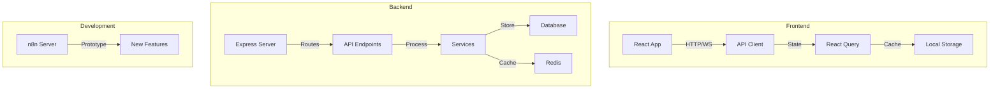
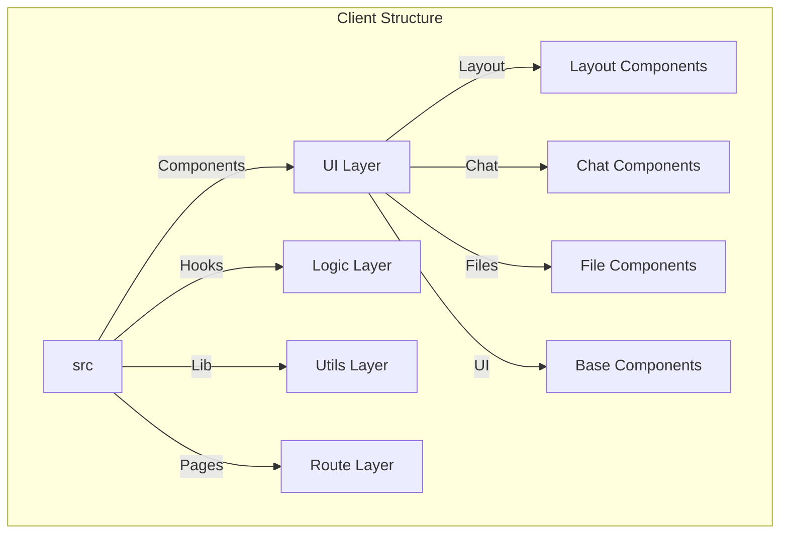
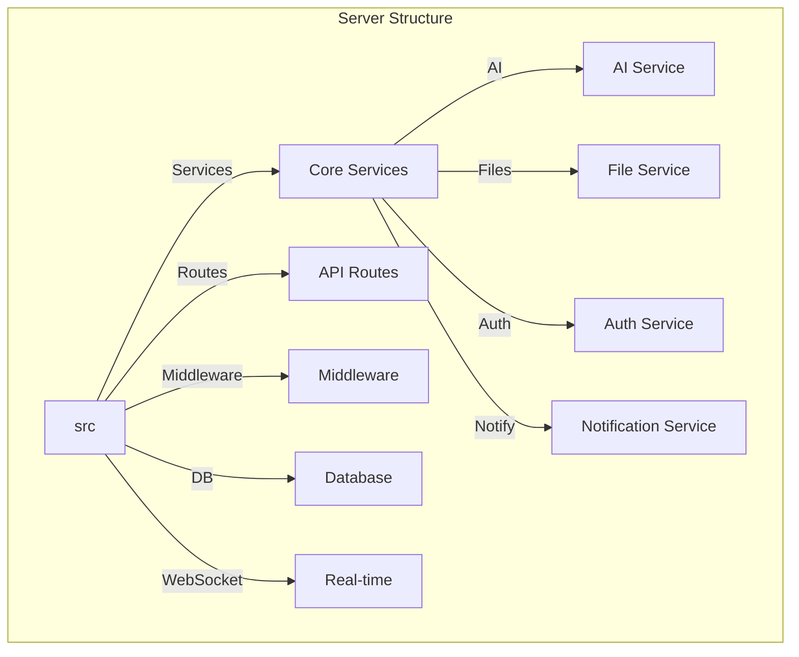
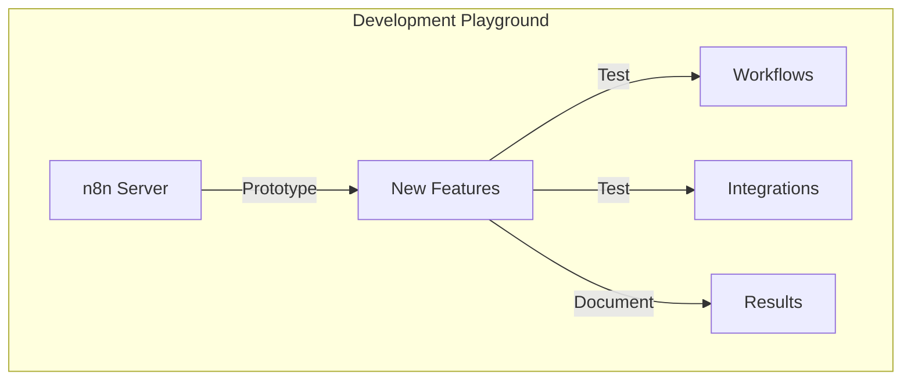
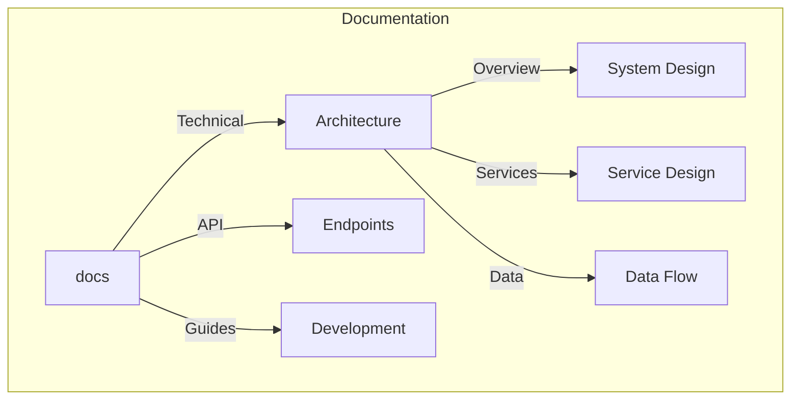
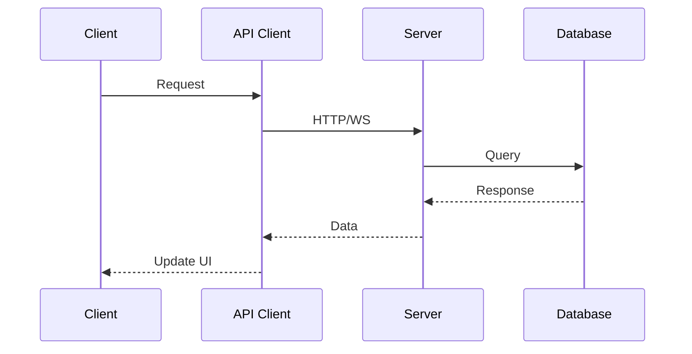
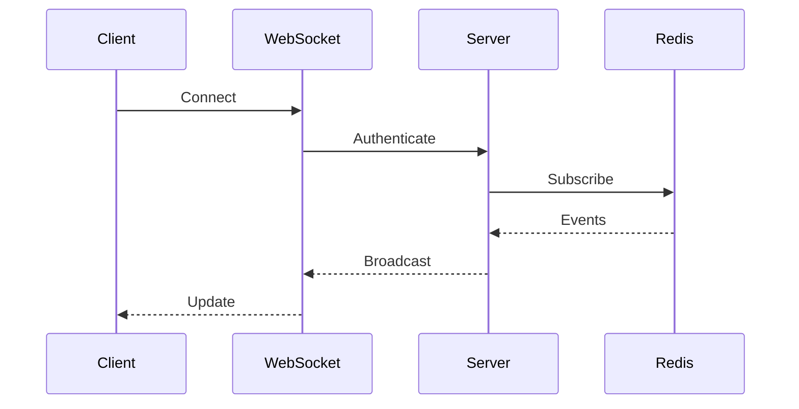
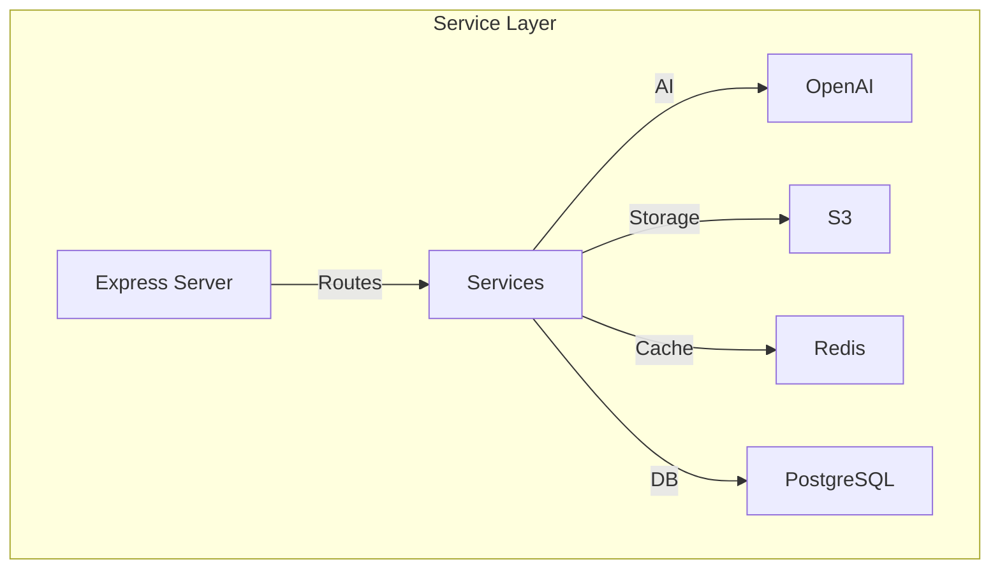

# 🌟 BetterGPT - Project File Tree Structure

This document provides a comprehensive overview of the project's file organization and directory structure, optimized for direct service implementations.

## 🔄 System Architecture Overview



## 📁 Root Directory Structure

```
better-gpt/
├── client/                   # Frontend React application
├── server/                   # Backend Express application
├── dev-playground/          # n8n development playground (non-production)
├── shared/                   # Shared types and schemas
├── docs/                     # Project documentation
│   ├── architecture/         # Technical architecture docs
│   ├── api/                  # API documentation
│   └── guides/              # Development guides
├── .gitignore               # Git ignore configuration
├── .env                     # Environment configuration
├── components.json          # Shadcn/ui components configuration
├── drizzle.config.ts        # Drizzle ORM configuration
├── package-lock.json        # NPM dependency lock file
├── package.json             # NPM package configuration
├── postcss.config.js        # PostCSS configuration
├── tailwind.config.ts       # Tailwind CSS configuration
├── tsconfig.json            # TypeScript configuration
└── vite.config.ts           # Vite build tool configuration
```

## 🎨 Client Directory Structure



```
client/
├── src/
│   ├── components/          # Reusable React components
│   │   ├── layout/          # Layout components (header, footer)
│   │   ├── chat/            # Chat-related components
│   │   │   ├── ChatWindow.tsx        # Thread pane w/ file previews
│   │   │   ├── MessageInput.tsx      # Slash-commands, prompt helpers
│   │   │   ├── ActionButtons.tsx     # "/new-doc", "/summarise" …
│   │   │   └── index.ts
│   │   ├── files/           # File management components
│   │   │   ├── FilePreview.tsx       # File preview component
│   │   │   ├── FileUpload.tsx        # File upload component
│   │   │   └── index.ts
│   │   └── ui/              # Shadcn/ui component library
│   ├── hooks/               # Custom React hooks
│   │   ├── useChatApi.ts    # Chat API integration
│   │   ├── useFilesApi.ts   # File management API
│   │   ├── useAuth.ts       # Authentication hook
│   │   └── useWebSocket.ts  # WebSocket connection hook
│   ├── lib/                 # Utility libraries
│   │   ├── api.ts           # API client setup
│   │   ├── auth.ts          # Authentication utilities
│   │   ├── queryClient.ts   # React Query configuration
│   │   └── utils.ts         # General utilities
│   ├── pages/               # Page components
│   │   ├── chat/            # Chat interface
│   │   ├── files/           # File management
│   │   ├── projects/        # Project management
│   │   └── settings/        # User settings
│   ├── App.tsx              # Main application component
│   └── main.tsx             # Application entry point
└── public/                  # Static assets
```

## 🖥️ Server Directory Structure



```
server/
├── src/
│   ├── services/            # Core service implementations
│   │   ├── ai.ts           # OpenAI integration
│   │   ├── chat.ts         # Chat management
│   │   ├── files.ts        # File processing & storage
│   │   ├── notifications.ts # Slack/Email integration
│   │   └── scheduler.ts    # Cron jobs & scheduled tasks
│   ├── routes/             # API route handlers
│   │   ├── chat.ts         # Chat endpoints
│   │   ├── files.ts        # File endpoints
│   │   ├── projects.ts     # Project endpoints
│   │   └── auth.ts         # Authentication endpoints
│   ├── middleware/         # Express middleware
│   │   ├── auth.ts         # Authentication middleware
│   │   ├── error.ts        # Error handling
│   │   └── validation.ts   # Request validation
│   ├── db/                 # Database configuration
│   │   ├── index.ts        # Database connection
│   │   └── migrations/     # Database migrations
│   ├── websocket/          # WebSocket implementation
│   │   ├── server.ts       # WebSocket server
│   │   └── handlers.ts     # Event handlers
│   ├── utils/              # Utility functions
│   │   ├── logger.ts       # Logging utility
│   │   └── validators.ts   # Validation utilities
│   └── config/             # Configuration files
│       ├── index.ts        # Main configuration
│       └── env.ts          # Environment variables
├── Dockerfile              # Server container definition
└── package.json           # Server dependencies
```

## 🎮 Development Playground



```
dev-playground/            # n8n development environment
├── Dockerfile             # n8n container definition
├── README.md             # Playground documentation
└── workflows/            # Example n8n workflows
    └── README.md         # Workflow documentation
```

## 📚 Documentation Structure



```
docs/
├── architecture/          # Technical architecture
│   ├── overview.md       # System overview
│   ├── services.md       # Service architecture
│   └── data-flow.md      # Data flow diagrams
├── api/                  # API documentation
│   ├── endpoints.md      # API endpoints
│   └── websocket.md      # WebSocket events
└── guides/              # Development guides
    ├── setup.md         # Development setup
    ├── deployment.md    # Deployment guide
    └── playground.md    # Development playground guide
```

## 🔑 Key File Purposes

### Configuration Files
- `package.json`: Defines project dependencies and scripts
- `tailwind.config.ts`: Configures Tailwind CSS utility classes
- `vite.config.ts`: Configures Vite build tool
- `drizzle.config.ts`: Configures Drizzle ORM
- `tsconfig.json`: TypeScript compiler configuration

### Core Application Files
- `client/src/App.tsx`: Main React application
- `client/src/main.tsx`: Application bootstrap
- `server/src/index.ts`: Express server setup
- `server/src/routes/`: API endpoint definitions
- `shared/schema.ts`: Database schema definitions

### Service Implementations
- `server/src/services/ai.ts`: OpenAI integration
- `server/src/services/files.ts`: File processing
- `server/src/services/notifications.ts`: External notifications
- `server/src/services/scheduler.ts`: Scheduled tasks

### Real-time Features
- `server/src/websocket/server.ts`: WebSocket server
- `server/src/websocket/handlers.ts`: Event handlers
- `client/src/hooks/useWebSocket.ts`: WebSocket hook

## 🚀 Application Architecture & Communication Flow

### Frontend-Backend Communication



```typescript
// client/src/hooks/useChatApi.ts
export function useChatApi() {
  const queryClient = useQueryClient();
  
  return {
    sendMessage: async (message: string) => {
      // Direct API call
      const response = await api.post('/chat/message', { message });
      
      // Update cache
      queryClient.invalidateQueries(['chat', 'messages']);
      
      return response.data;
    }
  };
}

// server/src/routes/chat.ts
router.post('/message', async (req, res) => {
  const { message } = req.body;
  
  // Process message
  const result = await chatService.processMessage(message);
  
  // Broadcast to WebSocket
  websocketServer.broadcast('chat.message', result);
  
  res.json(result);
});
```

### WebSocket Implementation



```typescript
// server/src/websocket/server.ts
export class WebSocketServer {
  private wss: WebSocket.Server;
  
  constructor() {
    this.wss = new WebSocket.Server({ port: 8080 });
    this.setupEventHandlers();
  }
  
  private setupEventHandlers() {
    this.wss.on('connection', (ws) => {
      ws.on('message', this.handleMessage.bind(this));
    });
  }
  
  broadcast(event: string, data: any) {
    this.wss.clients.forEach((client) => {
      if (client.readyState === WebSocket.OPEN) {
        client.send(JSON.stringify({ event, data }));
      }
    });
  }
}
```

### Service Integration



```typescript
// server/src/services/ai.ts
export class AIService {
  private openai: OpenAI;
  
  constructor() {
    this.openai = new OpenAI({
      apiKey: process.env.OPENAI_API_KEY
    });
  }
  
  async generateResponse(prompt: string) {
    const completion = await this.openai.chat.completions.create({
      model: "gpt-4",
      messages: [{ role: "user", content: prompt }]
    });
    
    return completion.choices[0].message.content;
  }
}

// server/src/services/files.ts
export class FileService {
  private s3: S3Client;
  
  constructor() {
    this.s3 = new S3Client({
      region: process.env.AWS_REGION
    });
  }
  
  async uploadFile(file: Buffer, key: string) {
    await this.s3.send(new PutObjectCommand({
      Bucket: process.env.AWS_BUCKET,
      Key: key,
      Body: file
    }));
  }
}
```

## 🎯 Key Architectural Principles

1. **Direct Service Integration**
   - All external services integrated directly
   - Clear service boundaries
   - Type-safe implementations

2. **Real-time Features**
   - WebSocket for live updates
   - Redis for pub/sub
   - Optimistic UI updates

3. **Type Safety**
   - End-to-end TypeScript
   - Shared schema definitions
   - Runtime validation

4. **Development Playground**
   - Separate n8n environment
   - No production dependencies
   - Clear documentation

Would you like me to elaborate on any part of this structure or show more detailed implementation examples? 