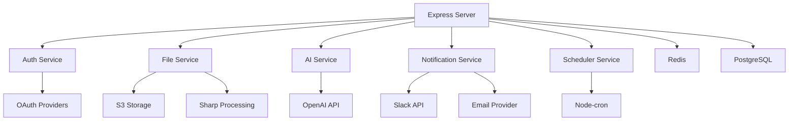

# 🌟 BetterGPT - Service Responsibilities & Architecture

This document outlines the service responsibilities and architecture for BetterGPT, focusing on direct service implementations while maintaining a development playground for future experimentation.

## 🗄️ Core Server Responsibilities

| Action/Responsibility                    | Explanation                                 | Implementation                                    | Notes                                                                 |
| ---------------------------------------- | ------------------------------------------- | ------------------------------------------------- | --------------------------------------------------------------------- |
| User Authentication (OAuth/JWT)          | Secure user auth, tokens issuance, refresh  | `server/src/services/auth.ts`                    | Direct OAuth provider integration                                    |
| CRUD Operations                          | Basic DB operations & REST endpoints        | `server/src/routes/` + `server/src/services/`    | Drizzle ORM for type-safe operations                                 |
| WebSocket Real-time Updates              | Real-time streams & live event handling     | `server/src/websocket/`                          | Redis pub/sub for cross-instance                                     |
| File Uploads/Downloads                   | Direct file interactions & storage          | `server/src/services/files.ts`                   | S3 integration with Sharp processing                                 |
| Schema Validation & ORM Management       | DB integrity & migrations                   | `shared/schema.ts` + `server/src/db/`            | Drizzle + Zod for runtime validation                                 |
| AI Integration                           | Direct OpenAI API integration               | `server/src/services/ai.ts`                      | GPT-4 with fallback options                                          |
| Scheduled Tasks                          | Automated tasks & maintenance               | `server/src/services/scheduler.ts`               | Node-cron for scheduling                                             |
| External Notifications                   | Slack/Email integration                     | `server/src/services/notifications.ts`           | Direct API integrations                                              |

## 🔄 Service Implementation Details

### 1. Authentication Service
```typescript
// server/src/services/auth.ts
export class AuthService {
  async authenticateUser(credentials: Credentials) {
    // Direct OAuth provider integration
    const user = await this.verifyCredentials(credentials);
    const token = this.generateJWT(user);
    return { user, token };
  }

  async refreshToken(token: string) {
    // JWT refresh logic
    return this.generateNewToken(token);
  }
}
```

### 2. File Service
```typescript
// server/src/services/files.ts
export class FileService {
  async uploadFile(file: Buffer, metadata: FileMetadata) {
    // Direct S3 upload
    const filePath = await this.uploadToS3(file);
    
    // Generate thumbnail if image
    if (this.isImage(file)) {
      const thumbnail = await this.generateThumbnail(file);
      await this.uploadToS3(thumbnail, 'thumbnails/');
    }
    
    // Store metadata
    return await db.insert(files).values({
      ...metadata,
      filePath,
      thumbnailPath
    });
  }
}
```

### 3. AI Service
```typescript
// server/src/services/ai.ts
export class AIService {
  async generateResponse(prompt: string, context: ProjectContext) {
    // Direct OpenAI integration
    const completion = await this.openai.chat.completions.create({
      model: "gpt-4",
      messages: [
        { role: "system", content: context.instructions },
        { role: "user", content: prompt }
      ]
    });
    
    return completion.choices[0].message.content;
  }
}
```

### 4. Notification Service
```typescript
// server/src/services/notifications.ts
export class NotificationService {
  async sendSlackNotification(message: string, channel: string) {
    // Direct Slack API integration
    await this.slack.chat.postMessage({
      channel,
      text: message
    });
  }

  async sendEmailDigest(userId: string) {
    // Direct email provider integration
    const user = await this.getUserPreferences(userId);
    await this.emailProvider.send({
      to: user.email,
      subject: "Weekly Digest",
      content: await this.generateDigestContent(userId)
    });
  }
}
```

## 🎮 Development Playground

The `dev-playground` directory serves as a development environment for:

| Feature                    | Purpose                                    | Implementation Notes                            |
| -------------------------- | ------------------------------------------ | ---------------------------------------------- |
| Agent Prototyping          | Test new AI agent concepts                 | Temporary implementation only                   |
| Workflow Experiments       | Complex automation testing                 | Must be migrated to main app if successful      |
| Integration Testing        | New service integration testing            | No production dependencies                      |

**Important Notes:**
* Features developed here are temporary and for prototyping only
* No production features should depend on this playground
* All successful prototypes must be implemented directly in the main application
* Clear documentation required for any playground experiments

## 🎯 Implementation Guidelines

### 1. Direct Service Integration
- All external services should be integrated directly
- Use TypeScript for type safety
- Implement proper error handling
- Include retry logic for external APIs

### 2. Real-time Features
- WebSocket for live updates
- Redis for pub/sub
- Optimistic UI updates
- Proper connection management

### 3. Security Considerations
- JWT for authentication
- Rate limiting
- Input validation
- Secure file handling

### 4. Performance Optimization
- Caching strategies
- Connection pooling
- Batch operations
- Resource cleanup

## 📊 Service Dependencies



## 🚀 Next Steps

1. **Core Services**
   - Implement direct service integrations
   - Set up monitoring and logging
   - Configure error handling

2. **Development Playground**
   - Set up n8n environment
   - Create documentation template
   - Define migration process

3. **Testing & Validation**
   - Unit tests for services
   - Integration tests
   - Performance testing

Would you like me to elaborate on any part of this structure or show more detailed implementation examples? 