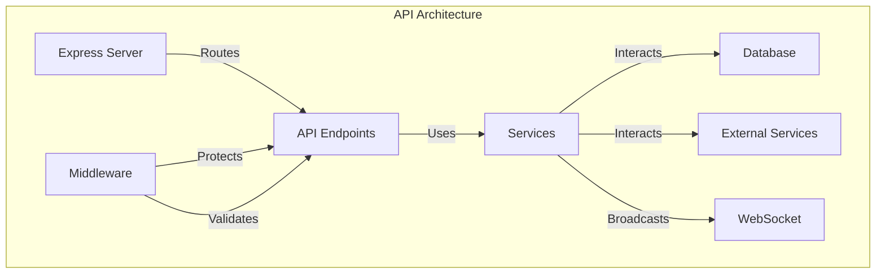
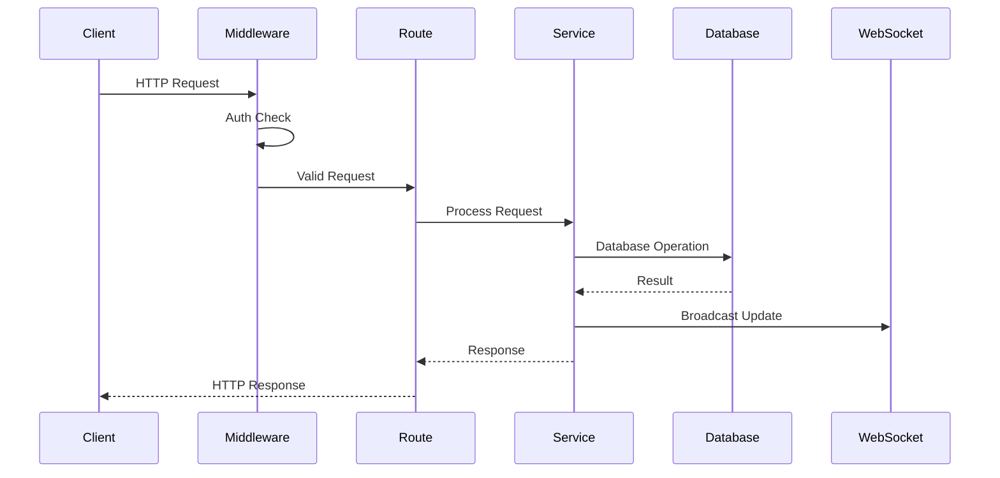
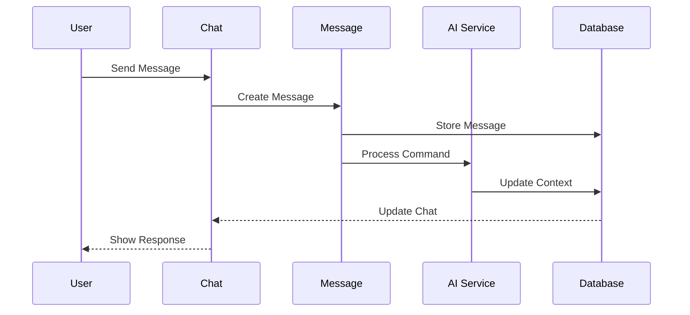
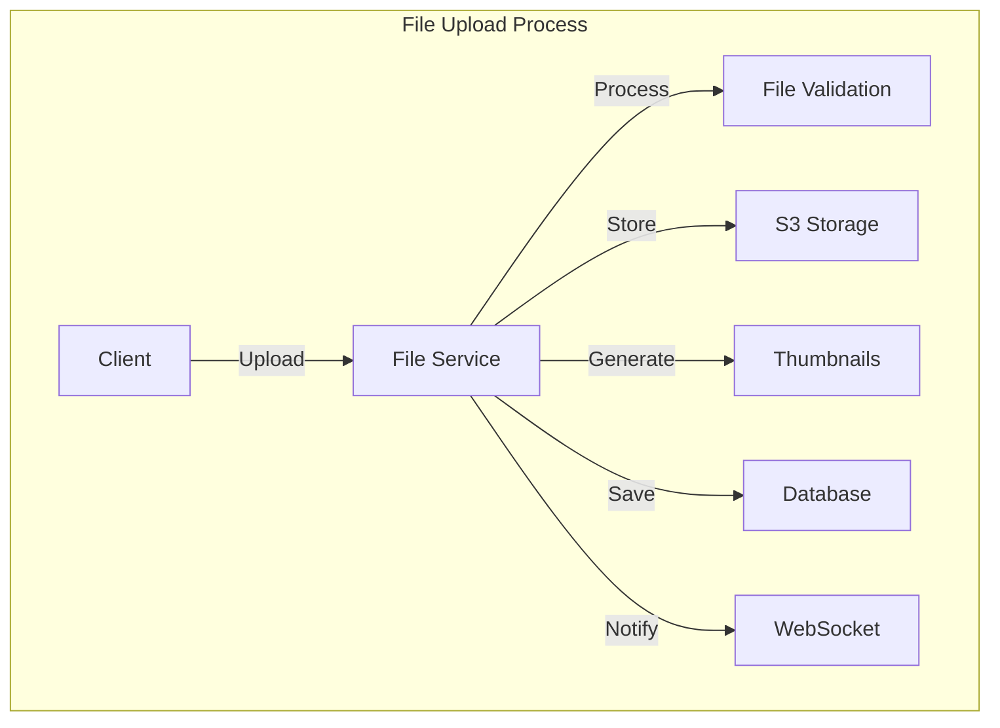
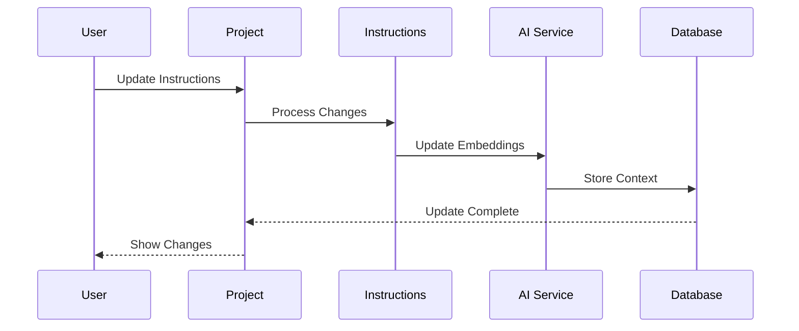
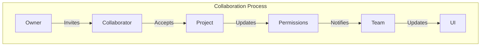
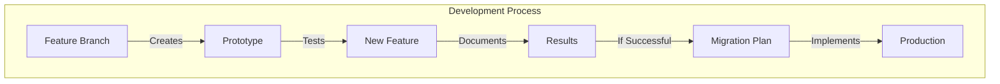
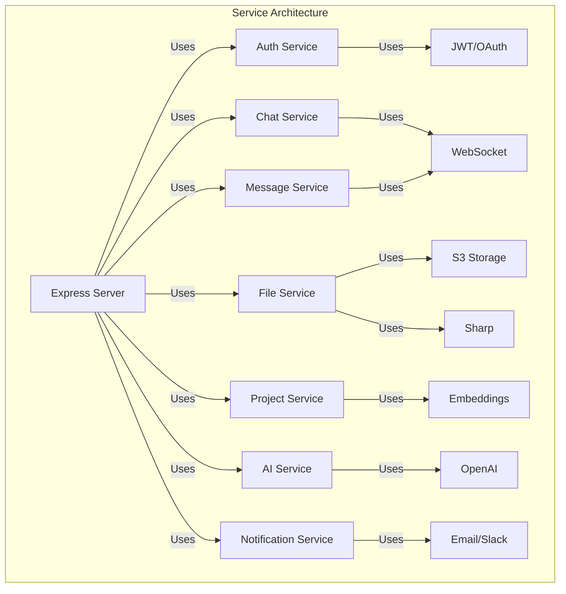

# 🌐 Detailed API Endpoints Integration Guide

This document thoroughly explains the API endpoints, their detailed interactions within the Express server, and the service implementations that handle various functionalities directly.

## 🔄 API Architecture Overview



## ✅ 1. Chat Endpoints

### **Request Flow**



### **Detailed Server Implementation**

```typescript
// server/src/routes/chats.ts
router.get('/', authMiddleware, async (req, res) => {
  const chats = await chatService.listChats(req.user.id);
  res.json(chats);
});

router.post('/', authMiddleware, async (req, res) => {
  const chat = await chatService.createChat(req.body, req.user.id);
  // Trigger real-time update
  wsService.broadcast('chat:created', chat);
  res.status(201).json(chat);
});

router.get('/:chatId', authMiddleware, async (req, res) => {
  const chat = await chatService.getChat(req.params.chatId);
  res.json(chat);
});

router.patch('/:chatId', authMiddleware, async (req, res) => {
  const chat = await chatService.updateChat(req.params.chatId, req.body);
  wsService.broadcast('chat:updated', chat);
  res.json(chat);
});

router.delete('/:chatId', authMiddleware, async (req, res) => {
  await chatService.deleteChat(req.params.chatId);
  wsService.broadcast('chat:deleted', { chatId: req.params.chatId });
  res.status(204).send();
});
```

### **Service Implementation**

```typescript
// server/src/services/chat.ts
export class ChatService {
  async createChat(data: CreateChatDTO, userId: string) {
    const chat = await db.insert(chats).values({
      ...data,
      userId,
      createdAt: new Date()
    }).returning();

    // Generate initial summary using AI service
    const summary = await this.aiService.generateSummary(chat[0]);
    await db.update(chats)
      .set({ summary })
      .where(eq(chats.id, chat[0].id));

    return chat[0];
  }

  async listChats(userId: string) {
    return await db.select()
      .from(chats)
      .where(eq(chats.userId, userId))
      .orderBy(desc(chats.updatedAt));
  }
}
```

## ✅ 2. Chat Messages Endpoints

### **Message Flow**



### **Detailed Server Implementation**

```typescript
// server/src/routes/messages.ts
router.get('/:chatId/messages', authMiddleware, async (req, res) => {
  const messages = await messageService.listMessages(req.params.chatId);
  res.json(messages);
});

router.post('/:chatId/messages', authMiddleware, async (req, res) => {
  const message = await messageService.createMessage(
    req.params.chatId,
    req.body,
    req.user.id
  );
  
  // Handle AI processing if needed
  if (message.content.startsWith('/')) {
    await aiService.processCommand(message);
  }
  
  wsService.broadcast('message:created', message);
  res.status(201).json(message);
});
```

### **Service Implementation**

```typescript
// server/src/services/message.ts
export class MessageService {
  async createMessage(chatId: string, data: CreateMessageDTO, userId: string) {
    const message = await db.insert(messages).values({
      ...data,
      chatId,
      userId,
      createdAt: new Date()
    }).returning();

    // Process message content
    if (data.content.startsWith('/')) {
      await this.processCommand(message[0]);
    }

    return message[0];
  }

  private async processCommand(message: Message) {
    const command = message.content.slice(1).split(' ')[0];
    switch (command) {
      case 'summarize':
        await this.aiService.generateSummary(message.chatId);
        break;
      case 'generate':
        await this.aiService.generateDocument(message);
        break;
      // ... other commands
    }
  }
}
```

## ✅ 3. File Management Endpoints

### **File Upload Flow**



### **Detailed Server Implementation**

```typescript
// server/src/routes/files.ts
router.post('/upload', authMiddleware, upload.single('file'), async (req, res) => {
  const file = await fileService.uploadFile(req.file, req.user.id);
  wsService.broadcast('file:uploaded', file);
  res.status(201).json(file);
});

router.get('/:fileId', authMiddleware, async (req, res) => {
  const file = await fileService.getFile(req.params.fileId);
  res.json(file);
});

router.delete('/:fileId', authMiddleware, async (req, res) => {
  await fileService.deleteFile(req.params.fileId);
  wsService.broadcast('file:deleted', { fileId: req.params.fileId });
  res.status(204).send();
});
```

### **Service Implementation**

```typescript
// server/src/services/file.ts
export class FileService {
  async uploadFile(file: Express.Multer.File, userId: string) {
    // Upload to S3
    const filePath = await this.s3Service.upload(file);
    
    // Generate thumbnail if image
    let thumbnailPath;
    if (this.isImage(file.mimetype)) {
      const thumbnail = await this.generateThumbnail(file.buffer);
      thumbnailPath = await this.s3Service.upload(thumbnail, 'thumbnails/');
    }
    
    // Store metadata
    const fileRecord = await db.insert(files).values({
      name: file.originalname,
      type: file.mimetype,
      size: file.size,
      path: filePath,
      thumbnailPath,
      userId,
      createdAt: new Date()
    }).returning();

    return fileRecord[0];
  }

  private async generateThumbnail(buffer: Buffer) {
    return await sharp(buffer)
      .resize(200, 200, { fit: 'inside' })
      .toBuffer();
  }
}
```

## ✅ 4. Project Context & Instruction Endpoints

### **Context Update Flow**



### **Detailed Server Implementation**

```typescript
// server/src/routes/projects.ts
router.get('/:projectId', authMiddleware, async (req, res) => {
  const project = await projectService.getProject(req.params.projectId);
  res.json(project);
});

router.patch('/:projectId', authMiddleware, async (req, res) => {
  const project = await projectService.updateProject(
    req.params.projectId,
    req.body
  );
  
  // Update embeddings if context changed
  if (req.body.instructions) {
    await aiService.updateEmbeddings(project);
  }
  
  wsService.broadcast('project:updated', project);
  res.json(project);
});
```

### **Service Implementation**

```typescript
// server/src/services/project.ts
export class ProjectService {
  async updateProject(projectId: string, data: UpdateProjectDTO) {
    const project = await db.update(projects)
      .set({
        ...data,
        updatedAt: new Date()
      })
      .where(eq(projects.id, projectId))
      .returning();

    // Update embeddings if instructions changed
    if (data.instructions) {
      await this.aiService.updateEmbeddings(project[0]);
    }

    return project[0];
  }
}
```

## ✅ 5. User Collaboration & Invitation Endpoints

### **Collaboration Flow**



### **Detailed Server Implementation**

```typescript
// server/src/routes/collaborators.ts
router.post('/:projectId/invite', authMiddleware, async (req, res) => {
  const invitation = await collaboratorService.inviteUser(
    req.params.projectId,
    req.body.email,
    req.user.id
  );
  
  // Send notification
  await notificationService.sendInvitation(invitation);
  
  res.status(201).json(invitation);
});

router.get('/:projectId/collaborators', authMiddleware, async (req, res) => {
  const collaborators = await collaboratorService.listCollaborators(
    req.params.projectId
  );
  res.json(collaborators);
});
```

### **Service Implementation**

```typescript
// server/src/services/collaborator.ts
export class CollaboratorService {
  async inviteUser(projectId: string, email: string, inviterId: string) {
    const invitation = await db.insert(invitations).values({
      projectId,
      email,
      inviterId,
      status: 'pending',
      createdAt: new Date()
    }).returning();

    // Send notification
    await this.notificationService.sendInvitation(invitation[0]);

    return invitation[0];
  }
}
```

## 🎮 Development Playground Integration

### **Development Flow**



```typescript
// dev-playground/ai-features/test-new-model.ts
async function testNewAIModel() {
  // Test implementation
  const result = await playgroundAIService.testFeature();
  
  // If successful, implement in main app
  if (result.success) {
    // Document implementation steps
    // Create migration plan
  }
}
```

## 📊 Service Dependencies



## 🚀 Next Steps

1. **Implementation**
   - Set up service classes
   - Configure middleware
   - Implement WebSocket handlers

2. **Testing**
   - Unit tests for services
   - Integration tests for endpoints
   - WebSocket testing

3. **Documentation**
   - OpenAPI/Swagger documentation
   - Service interaction diagrams
   - Development playground guides

Would you like me to elaborate on any part of this structure or show more detailed implementation examples? 