# 🌐 Server & API Design Guide

This document outlines REST API best practices, structured endpoint design, and strategies for optimizing Express middleware in our direct service implementation architecture.

## 🔄 Server Architecture Overview

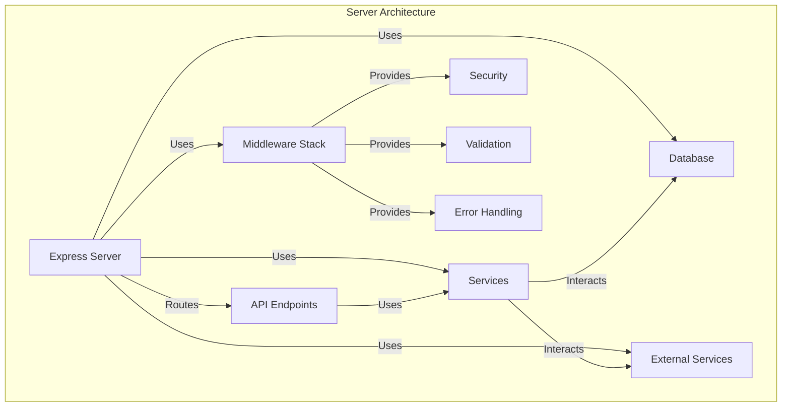

---

## 📌 REST API Best Practices

### ✅ API Structure

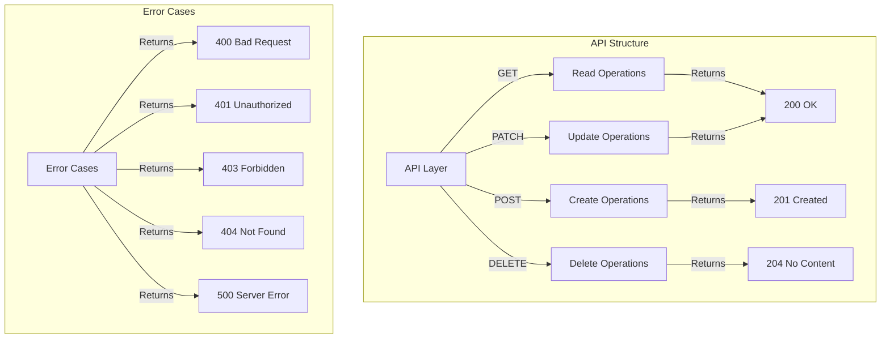

### ✅ Consistent Endpoint Naming

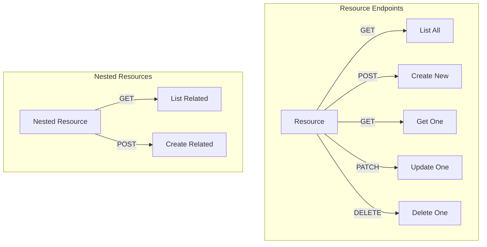

* Use clear, resource-based naming conventions
* Prefer nouns over verbs
* Use plural nouns for resources
* Follow hierarchical relationships

```typescript
// Example endpoint structure
GET    /projects              → List all projects
POST   /projects              → Create new project
GET    /projects/:id          → Get specific project
PATCH  /projects/:id          → Update project
DELETE /projects/:id          → Delete project

// Nested resources
GET    /projects/:id/chats    → List project chats
POST   /projects/:id/chats    → Create project chat
GET    /projects/:id/files    → List project files
```

### ✅ HTTP Methods & Status Codes

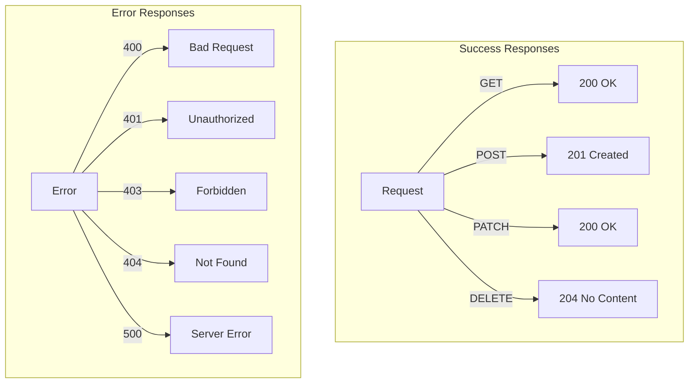

```typescript
// Success responses
200 OK                    → Successful GET/PATCH
201 Created              → Successful POST
204 No Content           → Successful DELETE

// Error responses
400 Bad Request          → Invalid input
401 Unauthorized         → Missing/invalid auth
403 Forbidden           → Insufficient permissions
404 Not Found           → Resource doesn't exist
409 Conflict            → Resource conflict
422 Unprocessable       → Validation error
500 Server Error        → Internal error
```

### ✅ Request/Response Format

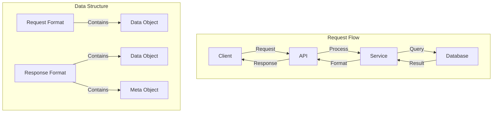

```typescript
// Request format
{
  "data": {
    "type": "project",
    "attributes": {
      "name": "My Project",
      "description": "Project description"
    }
  }
}

// Response format
{
  "data": {
    "id": "123",
    "type": "project",
    "attributes": {
      "name": "My Project",
      "description": "Project description",
      "createdAt": "2024-03-20T12:00:00Z"
    }
  },
  "meta": {
    "timestamp": "2024-03-20T12:00:00Z"
  }
}
```

---

## 📌 Service Layer Architecture

### ✅ Service Organization

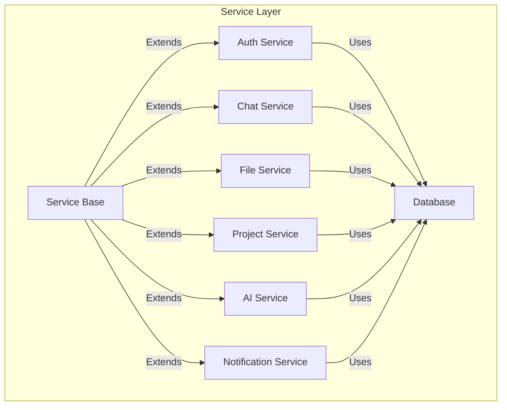

```typescript
// server/src/services/index.ts
export * from './auth.service';
export * from './chat.service';
export * from './file.service';
export * from './project.service';
export * from './ai.service';
export * from './notification.service';

// Example service structure
// server/src/services/chat.service.ts
export class ChatService {
  constructor(
    private db: Database,
    private aiService: AIService,
    private wsService: WebSocketService
  ) {}

  async createChat(data: CreateChatDTO, userId: string) {
    // Implementation
  }

  async listChats(userId: string) {
    // Implementation
  }
}
```

### ✅ Error Handling

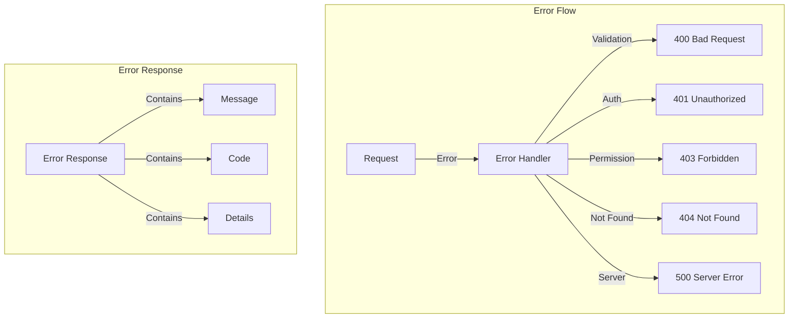

```typescript
// server/src/utils/errors.ts
export class AppError extends Error {
  constructor(
    public statusCode: number,
    public message: string,
    public code?: string
  ) {
    super(message);
  }
}

// Error handling middleware
app.use((err: Error, req: Request, res: Response, next: NextFunction) => {
  if (err instanceof AppError) {
    return res.status(err.statusCode).json({
      error: {
        message: err.message,
        code: err.code
      }
    });
  }

  console.error(err);
  res.status(500).json({
    error: {
      message: 'Internal server error',
      code: 'INTERNAL_ERROR'
    }
  });
});
```

---

## 📌 Middleware Stack

### ✅ Middleware Flow

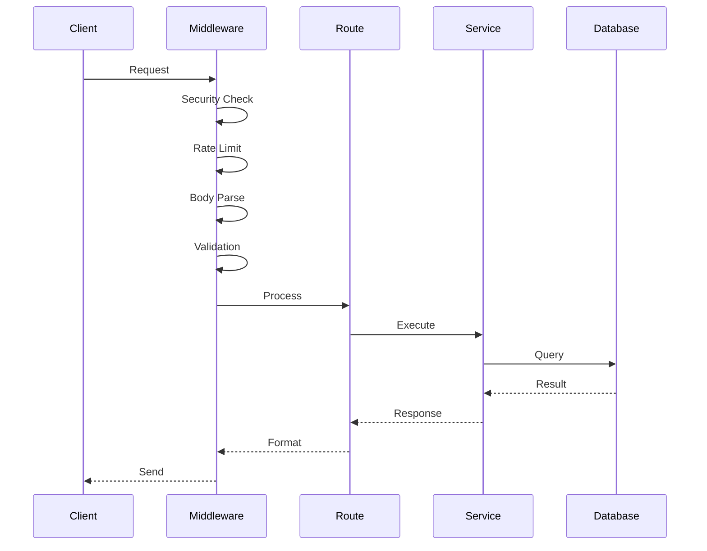

### ✅ Core Middleware Configuration

```typescript
// server/src/middleware/index.ts
import express from 'express';
import cors from 'cors';
import helmet from 'helmet';
import compression from 'compression';
import rateLimit from 'express-rate-limit';
import { errorHandler } from './error.middleware';
import { authMiddleware } from './auth.middleware';
import { validationMiddleware } from './validation.middleware';

const app = express();

// Security middleware
app.use(helmet());
app.use(cors({
  origin: process.env.ALLOWED_ORIGINS?.split(',') || '*',
  credentials: true
}));

// Rate limiting
app.use(rateLimit({
  windowMs: 15 * 60 * 1000, // 15 minutes
  max: 100 // limit each IP to 100 requests per windowMs
}));

// Body parsing
app.use(express.json({ limit: '10mb' }));
app.use(express.urlencoded({ extended: true }));

// Compression
app.use(compression());

// Custom middleware
app.use(authMiddleware);
app.use(validationMiddleware);

// Error handling
app.use(errorHandler);
```

### ✅ Custom Middleware Examples

```typescript
// server/src/middleware/auth.middleware.ts
export const authMiddleware = async (
  req: Request,
  res: Response,
  next: NextFunction
) => {
  try {
    const token = req.headers.authorization?.split(' ')[1];
    if (!token) {
      throw new AppError(401, 'No token provided');
    }

    const user = await authService.verifyToken(token);
    req.user = user;
    next();
  } catch (error) {
    next(error);
  }
};

// server/src/middleware/validation.middleware.ts
export const validationMiddleware = (schema: ZodSchema) => {
  return async (req: Request, res: Response, next: NextFunction) => {
    try {
      await schema.parseAsync(req.body);
      next();
    } catch (error) {
      next(new AppError(422, 'Validation error', 'VALIDATION_ERROR'));
    }
  };
};
```

---

## 📌 WebSocket Implementation

### ✅ WebSocket Flow

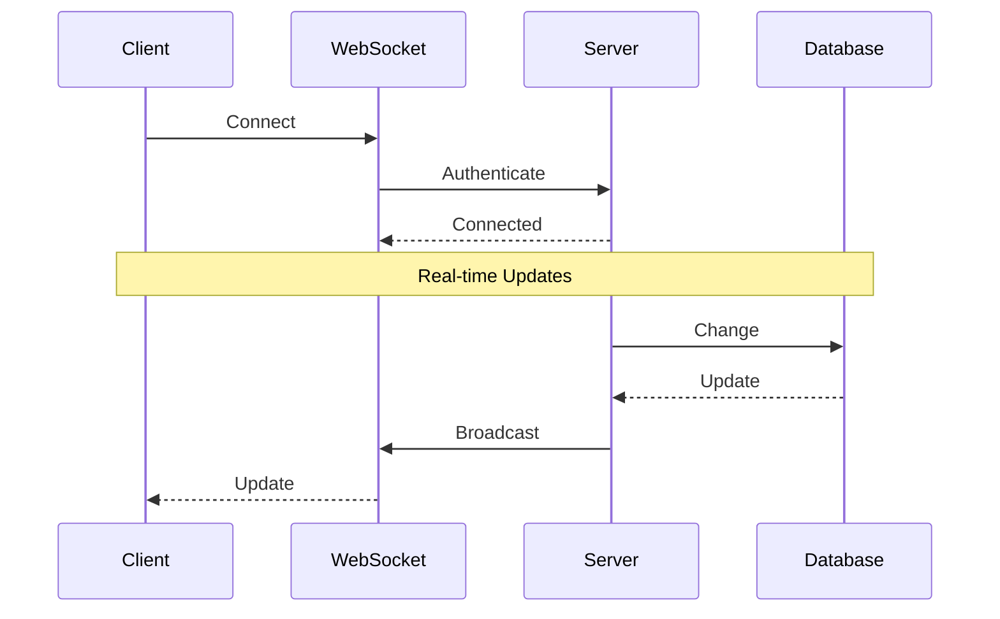

### ✅ WebSocket Service

```typescript
// server/src/services/websocket.service.ts
export class WebSocketService {
  private wss: WebSocketServer;

  constructor(server: Server) {
    this.wss = new WebSocketServer({ server });
    this.setupWebSocket();
  }

  private setupWebSocket() {
    this.wss.on('connection', (ws: WebSocket) => {
      // Handle connection
      ws.on('message', (message: string) => {
        this.handleMessage(ws, message);
      });
    });
  }

  public broadcast(event: string, data: any) {
    this.wss.clients.forEach((client) => {
      if (client.readyState === WebSocket.OPEN) {
        client.send(JSON.stringify({ event, data }));
      }
    });
  }
}
```

---

## 📌 Database Integration

### ✅ Database Flow

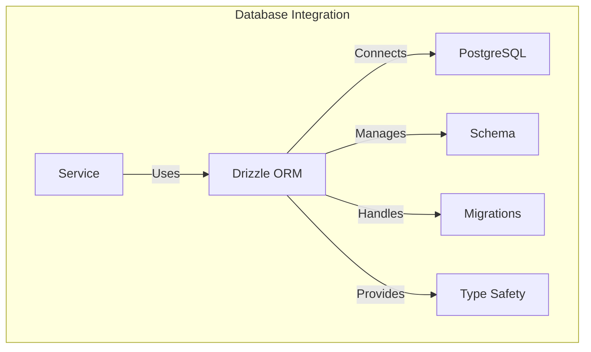

### ✅ Drizzle ORM Setup

```typescript
// server/src/db/index.ts
import { drizzle } from 'drizzle-orm/node-postgres';
import { Pool } from 'pg';
import * as schema from './schema';

const pool = new Pool({
  connectionString: process.env.DATABASE_URL
});

export const db = drizzle(pool, { schema });

// Example schema
// server/src/db/schema.ts
export const projects = pgTable('projects', {
  id: uuid('id').primaryKey().defaultRandom(),
  name: text('name').notNull(),
  description: text('description'),
  userId: uuid('user_id').notNull(),
  createdAt: timestamp('created_at').defaultNow(),
  updatedAt: timestamp('updated_at').defaultNow()
});
```

---

## 📌 Development Playground

### ✅ Development Flow

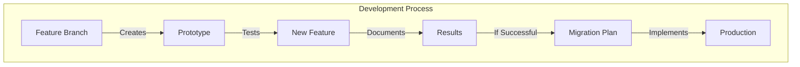

The development playground (`dev-playground`) serves as a testing environment for new features:

```typescript
// dev-playground/README.md
# Development Playground

This directory contains experimental features and prototypes that may be integrated into the main application.

## Structure
- `/ai-features` - AI-related experiments
- `/workflows` - Complex workflow prototypes
- `/integrations` - Third-party integration tests

## Usage
1. Create feature branch
2. Implement prototype
3. Document results
4. Create migration plan if successful
```

---

## 🚀 Next Steps

1. **Implementation**
   - Set up service classes
   - Configure middleware
   - Implement WebSocket handlers

2. **Testing**
   - Unit tests for services
   - Integration tests for endpoints
   - WebSocket testing

3. **Documentation**
   - OpenAPI/Swagger documentation
   - Service interaction diagrams
   - Development playground guides

Would you like me to elaborate on any part of this structure or show more detailed implementation examples? 