# 🌐 **Comprehensive Webhook Integration & n8n Workflow Guide**

## 📖 **Table of Contents**
1. [Understanding Webhooks](#-1-understanding-webhooks-general-server-context)
2. [Webhooks in n8n Context](#-2-webhooks-in-the-n8n-context)
3. [Practical Webhook Usage](#-3-practical-simultaneous-webhook-usage)
4. [API Endpoint Integration](#-comprehensive-n8n-api-endpoint-integration-guide)
5. [User Profile Update Example](#-5-webhook-for-user-profile-update-server-use-case)
6. [External Application Integration](#-6-webhooks-as-apis-for-external-applications)
7. [Best Practices & Next Steps](#-best-practices-recap)

---

## ✅ **1. Understanding Webhooks (General Server Context)**

### 🔍 **What Are Webhooks?**
Webhooks are automated HTTP callbacks triggered by events in a system. Unlike traditional APIs, which require polling, webhooks proactively send data to a specified URL immediately upon an event's occurrence.

#### Key Characteristics:
- **Event-Driven**: Triggered by specific events
- **Real-Time**: Immediate data transmission
- **Push-Based**: No need for constant polling
- **Asynchronous**: Non-blocking operation

### 🏗️ **Traditional Server Context Usage**

#### Flow Architecture:
```
Frontend → Backend → Webhook → External Service
```

#### Component Roles:
* **Frontend:** 
  - Sends requests (e.g., via forms, AJAX calls)
  - Handles webhook responses
  - Manages user interactions

* **Backend:** 
  - Processes frontend requests
  - Validates data
  - Triggers webhooks
  - Manages security

* **Third-party Apps:** 
  - Can trigger server-side actions
  - Receive webhook notifications
  - Process webhook data

### 🔐 **Webhook URL Configuration (Best Practices)**

#### Security Considerations:
- Use HTTPS for all webhook URLs
- Implement webhook signatures
- Rate limiting
- IP whitelisting
- Request validation

#### Environment Variable Structure:
```env
# Webhook URLs
N8N_CHAT_CREATE_WEBHOOK=https://your-n8n-instance.com/webhook/chat-create
N8N_MESSAGE_CREATE_WEBHOOK=https://your-n8n-instance.com/webhook/message-create
N8N_FILE_UPLOAD_WEBHOOK=https://your-n8n-instance.com/webhook/file-upload

# Security
WEBHOOK_SECRET=your-secret-key
WEBHOOK_TIMEOUT=5000
```

#### Server Route Example:
```typescript
// routes.ts
import { validateWebhookSignature } from '../utils/webhook';

app.post('/webhook/chat', async (req, res) => {
  // Validate webhook signature
  if (!validateWebhookSignature(req)) {
    return res.status(401).json({ error: 'Invalid signature' });
  }

  // Process webhook
  const chatId = req.body.chatId;
  await processChatWebhook(chatId);
  
  // Trigger n8n webhook
  await axios.post(process.env.N8N_CHAT_CREATE_WEBHOOK, { 
    chatId,
    timestamp: new Date().toISOString()
  });

  res.status(200).json({ success: true });
});
```

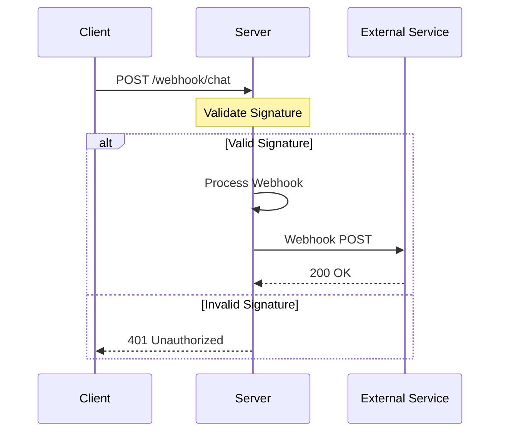
```mermaid
sequenceDiagram
    participant Client
    participant Server
    participant External Service
    
    Client->>Server: POST /webhook/chat
    Note over Server: Validate Signature
    alt Valid Signature
        Server->>Server: Process Webhook
        Server->>External Service: Webhook POST
        External Service-->>Server: 200 OK
    else Invalid Signature
        Server-->>Client: 401 Unauthorized
    end
```

---

## ✅ **2. Webhooks in the n8n Context**

### 🎯 **n8n Webhook Fundamentals**

#### Webhook Node Types:
1. **Standard Webhook**
   - Basic HTTP endpoint
   - Immediate response
   - Simple payload structure

2. **Response Webhook**
   - Waits for workflow completion
   - Returns workflow results
   - Supports long-running operations

3. **Dynamic Webhook**
   - URL generated at runtime
   - Temporary endpoints
   - One-time use cases

### ⚙️ **Webhook Node Setup (n8n)**

#### Configuration Options:
* **HTTP Method:** 
  - POST (most common)
  - GET (for simple triggers)
  - PUT/PATCH (for updates)
  - DELETE (for removals)

* **Webhook Path:** 
  - Defined per workflow
  - Example: `/chat-create`
  - Supports path parameters

* **Response Mode:** 
  - Immediate
  - After workflow completion
  - Custom response handling

#### Example n8n Webhook Configuration:
```json
{
  "name": "Chat Create Webhook",
  "type": "n8n-nodes-base.webhook",
  "parameters": {
    "path": "chat-create",
    "responseMode": "responseNode",
    "options": {
      "responseData": "allEntries",
      "responseContentType": "json"
    }
  }
}
```

### 🔄 **Server-n8n Integration**

#### Environment Configuration:
```env
# n8n Webhook URLs
N8N_CHAT_CREATE_WEBHOOK=https://your-n8n-instance.com/webhook/chat-create
N8N_USER_UPDATE_WEBHOOK=https://your-n8n-instance.com/webhook/user-update

# n8n API Configuration
N8N_API_KEY=your-api-key
N8N_BASE_URL=https://your-n8n-instance.com
```

#### Server Route Implementation:
```typescript
// routes.ts
import { n8nClient } from '../lib/n8n';

app.post('/chats', authMiddleware, async (req, res) => {
  try {
    // Create chat in database
    const chat = await createChat(req.body);
    
    // Trigger n8n webhook
    await n8nClient.triggerWebhook('chat-create', {
      chatId: chat.id,
      userId: req.user.id,
      timestamp: new Date().toISOString()
    });
    
    res.status(201).json(chat);
  } catch (error) {
    console.error('Chat creation failed:', error);
    res.status(500).json({ error: 'Failed to create chat' });
  }
});
```

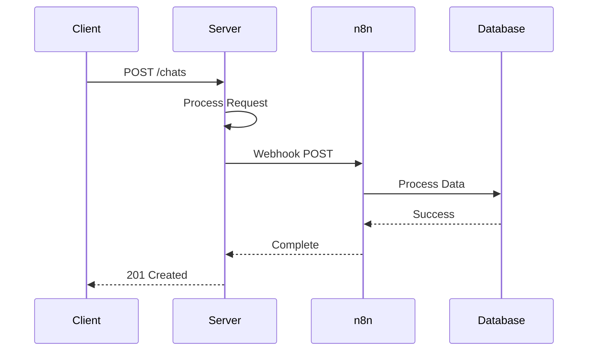
```mermaid
sequenceDiagram
    participant Client
    participant Server
    participant n8n
    participant Database
    
    Client->>Server: POST /chats
    Server->>Server: Process Request
    Server->>n8n: Webhook POST
    n8n->>Database: Process Data
    Database-->>n8n: Success
    n8n-->>Server: Complete
    Server-->>Client: 201 Created
```

---

## ✅ **3. Practical Simultaneous Webhook Usage**

### 🔄 **Integration Patterns**

#### 1. Frontend → n8n Direct Integration
```typescript
// Frontend component
const handleChatCreate = async () => {
  try {
    const response = await axios.post('/api/chats', {
      title: 'New Chat',
      participants: selectedUsers
    });
    
    // Handle success
    toast.success('Chat created successfully');
  } catch (error) {
    // Handle error
    toast.error('Failed to create chat');
  }
};
```

#### 2. Backend → n8n Integration
```typescript
// Server route
app.post('/chats', authMiddleware, async (req, res) => {
  const chat = await createChat(req.body);
  
  // Trigger n8n workflow
  await axios.post(process.env.N8N_CHAT_CREATE_WEBHOOK, {
    chatId: chat.id,
    metadata: {
      createdBy: req.user.id,
      timestamp: new Date().toISOString()
    }
  });
  
  res.status(201).json(chat);
});
```

#### 3. External App Integration
```typescript
// External app webhook handler
app.post('/webhook/external', async (req, res) => {
  // Validate webhook
  if (!isValidWebhook(req)) {
    return res.status(401).json({ error: 'Invalid webhook' });
  }
  
  // Process webhook data
  const { event, data } = req.body;
  
  // Trigger appropriate n8n workflow
  await triggerN8nWorkflow(event, data);
  
  res.status(200).json({ success: true });
});
```

### 📦 **File Upload Example**

#### Server Configuration:
```env
# File upload webhooks
N8N_FILE_UPLOAD_WEBHOOK=https://your-n8n-instance.com/webhook/file-upload
N8N_FILE_PROCESSING_WEBHOOK=https://your-n8n-instance.com/webhook/file-processing
```

#### Implementation:
```typescript
// routes.ts
app.post('/files/upload', 
  authMiddleware, 
  uploadMiddleware, 
  async (req, res) => {
    try {
      // Store file
      const file = await storeFile(req.file);
      
      // Trigger n8n workflow
      await axios.post(process.env.N8N_FILE_UPLOAD_WEBHOOK, {
        fileId: file.id,
        fileUrl: file.url,
        metadata: {
          uploadedBy: req.user.id,
          timestamp: new Date().toISOString()
        }
      });
      
      res.status(201).json(file);
    } catch (error) {
      console.error('File upload failed:', error);
      res.status(500).json({ error: 'Failed to upload file' });
    }
  }
);
```

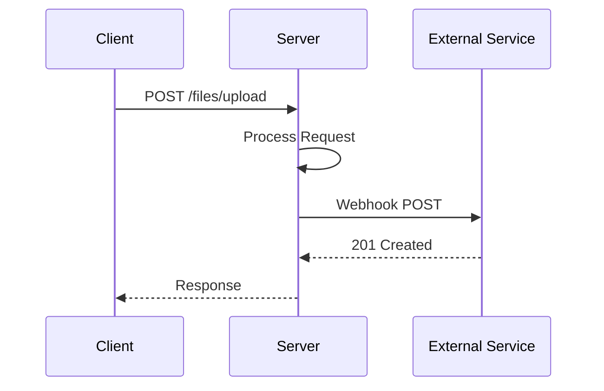
```mermaid
sequenceDiagram
    participant Client
    participant Server
    participant External Service
    
    Client->>Server: POST /files/upload
    Server->>Server: Process Request
    Server->>External Service: Webhook POST
    External Service-->>Server: 201 Created
    Server-->>Client: Response
```

---

## 🚦 **Comprehensive n8n API Endpoint Integration Guide**

### 📌 **1. Using API Endpoints as Triggers**

#### Webhook Node Configuration:
```json
{
  "name": "Chat Create Trigger",
  "type": "n8n-nodes-base.webhook",
  "parameters": {
    "path": "chat-create",
    "responseMode": "responseNode",
    "options": {
      "responseData": "allEntries",
      "responseContentType": "json"
    }
  }
}
```

#### Detailed Flow:
```
Frontend POST /chats
  └─ Server creates chat
    └─ Triggers n8n webhook
      └─ n8n workflow executes
        ├─ GPT-4 summarization
        ├─ Notification dispatch
        └─ Database updates
```

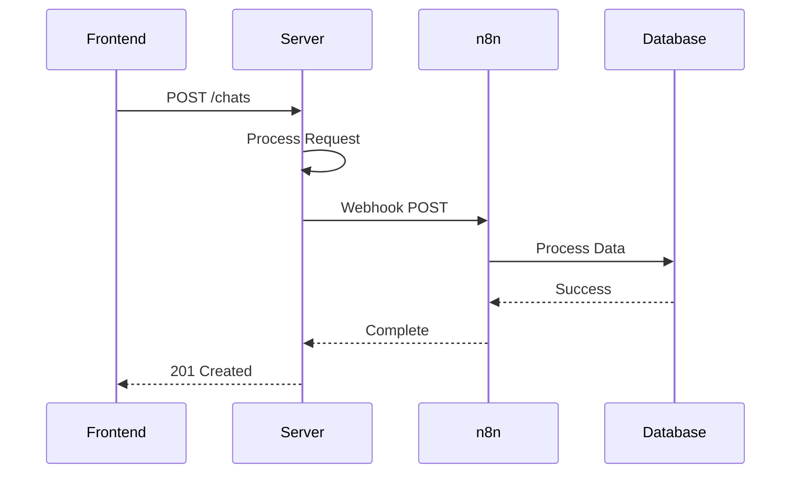
```mermaid
sequenceDiagram
    participant Frontend
    participant Server
    participant n8n
    participant Database
    
    Frontend->>Server: POST /chats
    Server->>Server: Process Request
    Server->>n8n: Webhook POST
    n8n->>Database: Process Data
    Database-->>n8n: Success
    n8n-->>Server: Complete
    Server-->>Frontend: 201 Created
```

### 📌 **2. Using API Endpoints as Workflow Actions**

#### HTTP Request Node Setup:
```json
{
  "name": "Update File Metadata",
  "type": "n8n-nodes-base.httpRequest",
  "parameters": {
    "method": "PATCH",
    "url": "{{ $env.SERVER_URL }}/files/{{$json.fileId}}",
    "headers": {
      "Authorization": "Bearer {{ $env.API_KEY }}",
      "Content-Type": "application/json"
    },
    "body": {
      "thumbnailUrl": "{{ $json.thumbnailUrl }}",
      "processedAt": "{{ $now }}"
    }
  }
}
```

#### Workflow Example:
```
File Upload → Process Image → Update Metadata → Send Notification
```

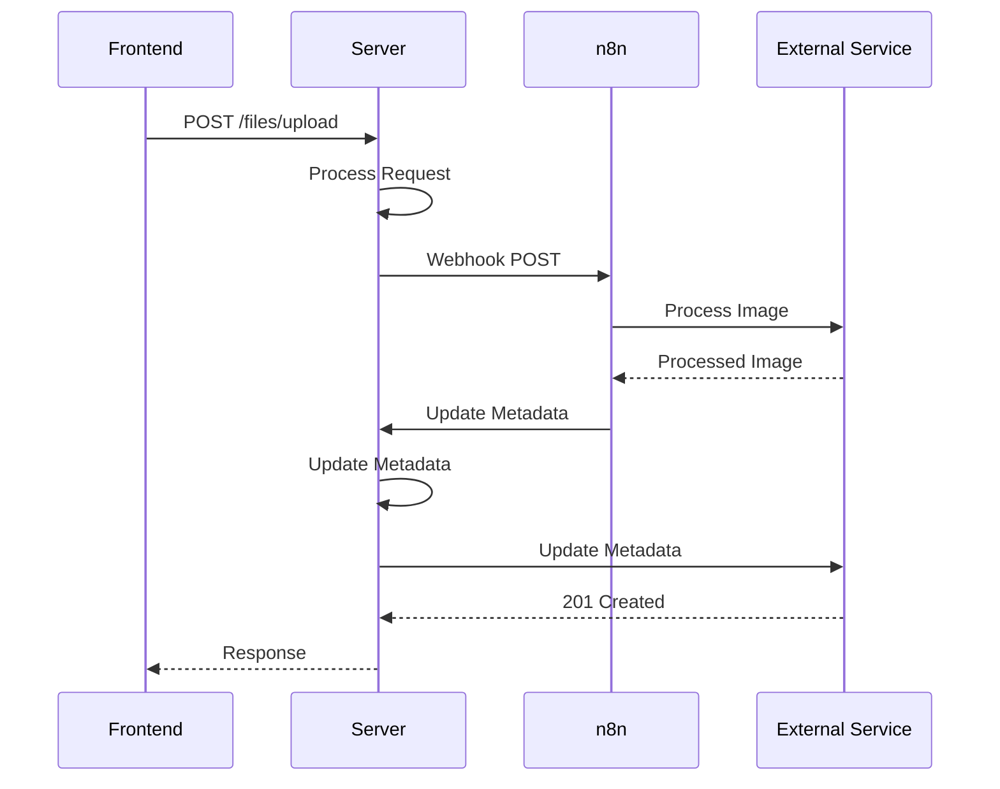
```mermaid
sequenceDiagram
    participant Frontend
    participant Server
    participant n8n
    participant External Service
    
    Frontend->>Server: POST /files/upload
    Server->>Server: Process Request
    Server->>n8n: Webhook POST
    n8n->>External Service: Process Image
    External Service-->>n8n: Processed Image
    n8n->>Server: Update Metadata
    Server->>Server: Update Metadata
    Server->>External Service: Update Metadata
    External Service-->>Server: 201 Created
    Server-->>Frontend: Response
```

### 📌 **3. Validation in Workflows**

#### Server-side Validation:
```typescript
// Validation middleware
const validateMessage = (req, res, next) => {
  const { content, chatId } = req.body;
  
  if (!content) {
    return res.status(400).json({ 
      error: "Content required",
      details: "Message content cannot be empty"
    });
  }
  
  if (!chatId) {
    return res.status(400).json({ 
      error: "Chat ID required",
      details: "Message must be associated with a chat"
    });
  }
  
  next();
};

// Route implementation
app.post('/chats/:chatId/messages', 
  authMiddleware,
  validateMessage,
  async (req, res) => {
    const message = await createMessage(req.params.chatId, req.body);
    
    // Trigger n8n workflow
    await axios.post(process.env.N8N_MESSAGE_CREATE_WEBHOOK, {
      messageId: message.id,
      chatId: req.params.chatId
    });
    
    res.status(201).json(message);
  }
);
```

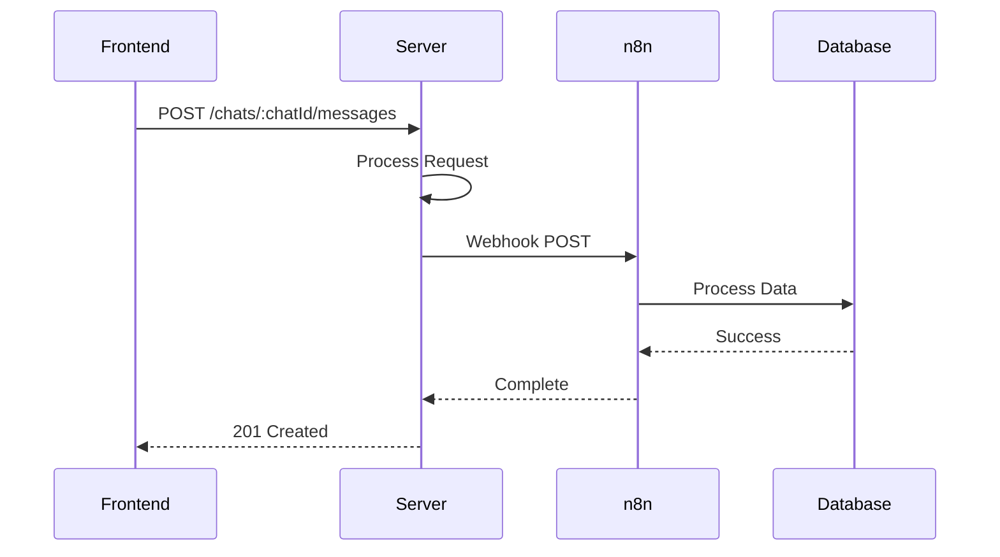
```mermaid
sequenceDiagram
    participant Frontend
    participant Server
    participant n8n
    participant Database
    
    Frontend->>Server: POST /chats/:chatId/messages
    Server->>Server: Process Request
    Server->>n8n: Webhook POST
    n8n->>Database: Process Data
    Database-->>n8n: Success
    n8n-->>Server: Complete
    Server-->>Frontend: 201 Created
```

### 📌 **4. API Responses as Workflow Outputs**

#### Semantic Embedding Example:
```typescript
// Server endpoint
app.post('/projects/:projectId/embeddings', 
  authMiddleware,
  async (req, res) => {
    const { embeddingVector } = req.body;
    
    // Store embedding
    const embedding = await storeEmbedding(
      req.params.projectId,
      embeddingVector
    );
    
    // Trigger n8n workflow
    await axios.post(process.env.N8N_EMBEDDING_CREATE_WEBHOOK, {
      embeddingId: embedding.id,
      projectId: req.params.projectId
    });
    
    res.status(201).json(embedding);
  }
);
```

#### n8n Workflow Configuration:
```json
{
  "name": "Process Embedding",
  "type": "n8n-nodes-base.httpRequest",
  "parameters": {
    "method": "POST",
    "url": "{{ $env.SERVER_URL }}/projects/{{$json.projectId}}/embeddings",
    "headers": {
      "Authorization": "Bearer {{ $env.API_KEY }}",
      "Content-Type": "application/json"
    },
    "body": {
      "embeddingVector": "{{ $json.embeddingVector }}"
    }
  }
}
```

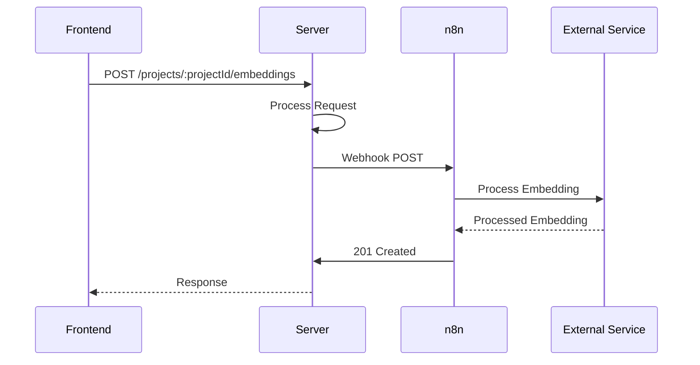
```mermaid
sequenceDiagram
    participant Frontend
    participant Server
    participant n8n
    participant External Service
    
    Frontend->>Server: POST /projects/:projectId/embeddings
    Server->>Server: Process Request
    Server->>n8n: Webhook POST
    n8n->>External Service: Process Embedding
    External Service-->>n8n: Processed Embedding
    n8n->>Server: 201 Created
    Server-->>Frontend: Response
```

### 📌 **Complete End-to-End Workflow Example**

#### Chat Creation Flow:
```
1. Frontend creates chat
   POST /chats
   
2. Server processes request
   - Validates input
   - Creates chat record
   - Triggers n8n webhook
   
3. n8n workflow executes
   - GPT-4 generates summary
   - Updates database
   - Sends notifications
   
4. Server responds
   - Returns chat data
   - Includes workflow status
   
5. Frontend updates
   - React-Query cache update
   - UI refresh
```

#### Error Handling:
```typescript
// Server error handling
app.use((err, req, res, next) => {
  console.error('Server error:', err);
  
  // Log to monitoring service
  logError(err);
  
  // Notify via n8n
  axios.post(process.env.N8N_ERROR_WEBHOOK, {
    error: err.message,
    stack: err.stack,
    timestamp: new Date().toISOString()
  });
  
  res.status(500).json({ 
    error: 'Internal server error',
    requestId: req.id
  });
});
```

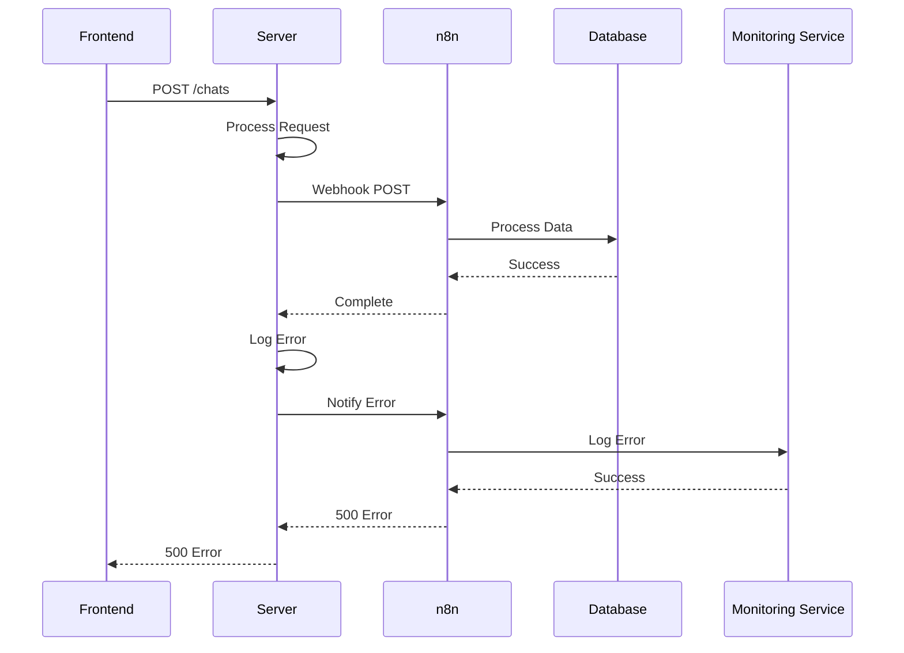
```mermaid
sequenceDiagram
    participant Frontend
    participant Server
    participant n8n
    participant Database
    
    Frontend->>Server: POST /chats
    Server->>Server: Process Request
    Server->>n8n: Webhook POST
    n8n->>Database: Process Data
    Database-->>n8n: Success
    n8n-->>Server: Complete
    Server->>Server: Log Error
    Server->>n8n: Notify Error
    n8n->>Monitoring Service: Log Error
    Monitoring Service-->>n8n: Success
    n8n-->>Server: 500 Error
    Server-->>Frontend: 500 Error
```

---

## ✅ **5. Webhook for User Profile Update**

### 🔄 **Complete Flow**

#### 1. Frontend Implementation:
```typescript
// User profile component
const updateProfile = async (data) => {
  try {
    const response = await axios.patch(
      `/users/${userId}`,
      data
    );
    
    // Update local state
    setUser(response.data);
    
    // Show success message
    toast.success('Profile updated successfully');
  } catch (error) {
    toast.error('Failed to update profile');
  }
};
```

#### 2. Server Implementation:
```typescript
// routes.ts
app.patch('/users/:userId', 
  authMiddleware,
  validateProfileUpdate,
  async (req, res) => {
    try {
      // Update user
      const updatedUser = await updateUser(
        req.params.userId,
        req.body
      );
      
      // Trigger n8n workflow
      await axios.post(
        process.env.N8N_USER_UPDATE_WEBHOOK,
        {
          userId: updatedUser.id,
          changes: req.body,
          timestamp: new Date().toISOString()
        }
      );
      
      res.status(200).json(updatedUser);
    } catch (error) {
      console.error('Profile update failed:', error);
      res.status(500).json({ error: 'Failed to update profile' });
    }
  }
);
```

#### 3. n8n Workflow:
```json
{
  "name": "User Profile Update",
  "nodes": [
    {
      "name": "Webhook",
      "type": "n8n-nodes-base.webhook",
      "parameters": {
        "path": "user-update",
        "responseMode": "responseNode"
      }
    },
    {
      "name": "Send Notification",
      "type": "n8n-nodes-base.slack",
      "parameters": {
        "channel": "user-updates",
        "message": "User {{$json.userId}} updated their profile"
      }
    },
    {
      "name": "Update Search Index",
      "type": "n8n-nodes-base.httpRequest",
      "parameters": {
        "method": "POST",
        "url": "{{ $env.SEARCH_API }}/users/{{$json.userId}}/index",
        "body": "{{$json}}"
      }
    }
  ]
}
```

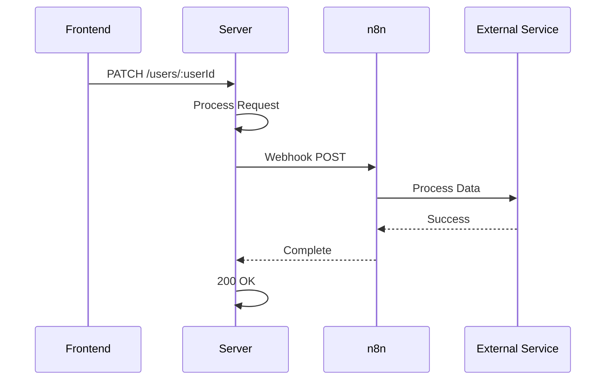
```mermaid
sequenceDiagram
    participant Frontend
    participant Server
    participant n8n
    participant External Service
    
    Frontend->>Server: PATCH /users/:userId
    Server->>Server: Process Request
    Server->>n8n: Webhook POST
    n8n->>External Service: Process Data
    External Service-->>n8n: Success
    n8n-->>Server: Complete
    Server->>Server: 200 OK
```

---

## ✅ **6. Webhooks as APIs for External Applications**

### 🔌 **Integration Patterns**

#### 1. Direct Webhook Integration:
```typescript
// External app webhook handler
app.post('/webhook/external', async (req, res) => {
  // Validate webhook
  if (!isValidWebhook(req)) {
    return res.status(401).json({ error: 'Invalid webhook' });
  }
  
  // Process webhook data
  const { event, data } = req.body;
  
  // Trigger n8n workflow
  await axios.post(
    process.env.N8N_EXTERNAL_WEBHOOK,
    {
      event,
      data,
      source: 'external-app',
      timestamp: new Date().toISOString()
    }
  );
  
  res.status(200).json({ success: true });
});
```

#### 2. n8n Workflow Configuration:
```json
{
  "name": "External App Integration",
  "nodes": [
    {
      "name": "Webhook",
      "type": "n8n-nodes-base.webhook",
      "parameters": {
        "path": "external-app",
        "responseMode": "responseNode"
      }
    },
    {
      "name": "Process Data",
      "type": "n8n-nodes-base.function",
      "parameters": {
        "functionCode": "// Process external data"
      }
    },
    {
      "name": "Update Database",
      "type": "n8n-nodes-base.httpRequest",
      "parameters": {
        "method": "POST",
        "url": "{{ $env.SERVER_URL }}/external-data",
        "body": "{{$json}}"
      }
    }
  ]
}
```

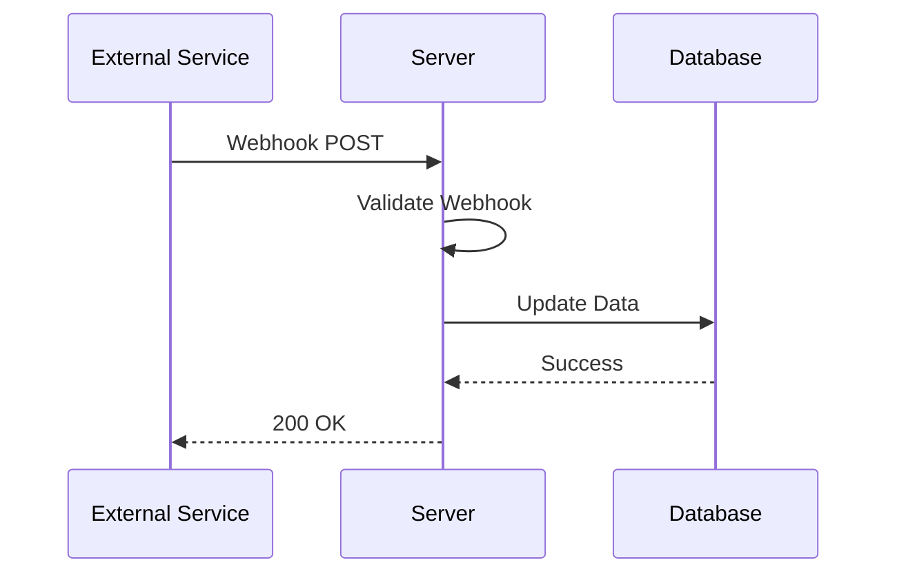
```mermaid
sequenceDiagram
    participant External Service
    participant Server
    participant Database
    
    External Service->>Server: Webhook POST
    Server->>Server: Validate Webhook
    Server->>Database: Update Data
    Database-->>Server: Success
    Server-->>External Service: 200 OK
```

---

## 📌 **Best Practices Recap**

### 🔒 **Security**
- Use HTTPS for all webhook URLs
- Implement webhook signatures
- Rate limiting
- IP whitelisting
- Request validation

### 📝 **Documentation**
- Document all webhook URLs
- Specify payload structures
- Include example requests/responses
- Document error handling

### 🔍 **Monitoring**
- Log all webhook requests
- Track success/failure rates
- Monitor response times
- Set up alerts for failures

### 🛠️ **Error Handling**
- Implement retry logic
- Log detailed error information
- Set up error notifications
- Provide clear error messages

---

## 📊 **Recommended Next Steps**

### 1. Documentation
- Create comprehensive webhook documentation
- Include payload examples
- Document error scenarios
- Add troubleshooting guides

### 2. Monitoring
- Set up webhook request logging
- Implement performance monitoring
- Create dashboards for webhook metrics
- Set up alerting for failures

### 3. Testing
- Create webhook test suite
- Implement integration tests
- Set up staging environment
- Create load testing scenarios

### 4. Security
- Review webhook security measures
- Implement additional validation
- Set up security monitoring
- Create security documentation

---

This enhanced guide provides comprehensive coverage of webhook integration with n8n, including detailed examples, best practices, and implementation patterns. Use this as a reference for implementing and maintaining webhook-based workflows in your application.

### 📌 **Three Primary Webhook Contexts**

#### 1. Server Context
- **Purpose**: Internal system communication
- **Flow**: Server → External Service
- **Example**: Your Express server triggering a notification service
```typescript
// Server triggering external service
app.post('/notifications', async (req, res) => {
  await axios.post('https://notification-service.com/webhook', {
    message: 'New notification',
    userId: req.user.id
  });
});
```

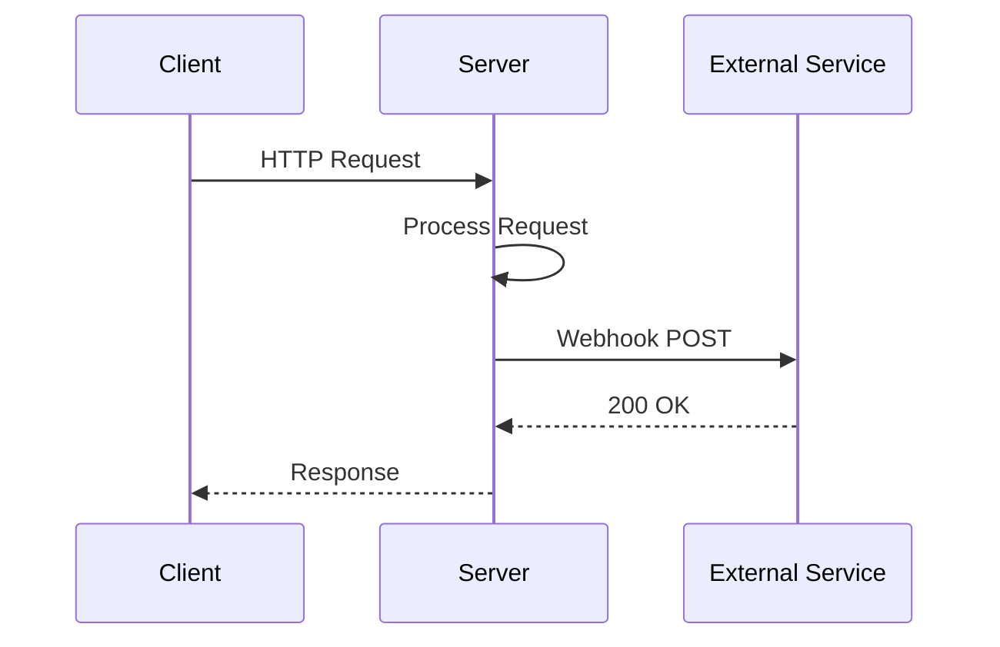
```mermaid
sequenceDiagram
    participant Client
    participant Server
    participant External Service
    
    Client->>Server: HTTP Request
    Server->>Server: Process Request
    Server->>External Service: Webhook POST
    External Service-->>Server: 200 OK
    Server-->>Client: Response
```

#### 2. n8n Context
- **Purpose**: Workflow automation and integration
- **Flow**: Server → n8n → Multiple Services
- **Example**: Chat creation triggering multiple automated actions
```typescript
// Server triggering n8n workflow
app.post('/chats', async (req, res) => {
  const chat = await createChat(req.body);
  await axios.post(process.env.N8N_CHAT_WEBHOOK, {
    chatId: chat.id,
    action: 'created'
  });
});
```

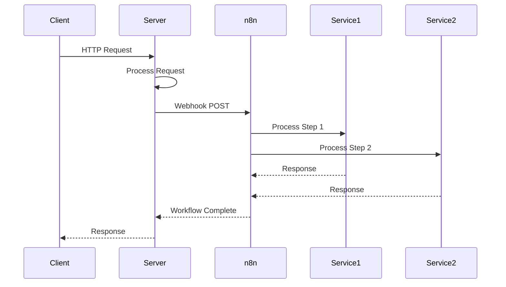
```mermaid
sequenceDiagram
    participant Client
    participant Server
    participant n8n
    participant Service1
    participant Service2
    
    Client->>Server: HTTP Request
    Server->>Server: Process Request
    Server->>n8n: Webhook POST
    n8n->>Service1: Process Step 1
    n8n->>Service2: Process Step 2
    Service1-->>n8n: Response
    Service2-->>n8n: Response
    n8n-->>Server: Workflow Complete
    Server-->>Client: Response
```

#### 3. External Context
- **Purpose**: Third-party service integration
- **Flow**: External Service → Your Server
- **Example**: Stripe payment notifications
```typescript
// Handling external webhook
app.post('/webhook/stripe', async (req, res) => {
  const event = stripe.webhooks.constructEvent(
    req.body,
    req.headers['stripe-signature'],
    process.env.STRIPE_WEBHOOK_SECRET
  );
  // Process Stripe event
});
```


```mermaid
sequenceDiagram
    participant External Service
    participant Server
    participant Database
    
    External Service->>Server: Webhook POST
    Server->>Server: Validate Webhook
    Server->>Database: Update Data
    Database-->>Server: Success
    Server-->>External Service: 200 OK
```

### 🔍 **Webhooks vs Traditional APIs**

#### Traditional Frontend-Backend API
```typescript
// Traditional API Flow
Frontend → Backend → Database
  ↑          ↓
  └──────────┘
  (Response)

// Example
app.get('/api/users', async (req, res) => {
  const users = await db.users.findAll();
  res.json(users);
});
```

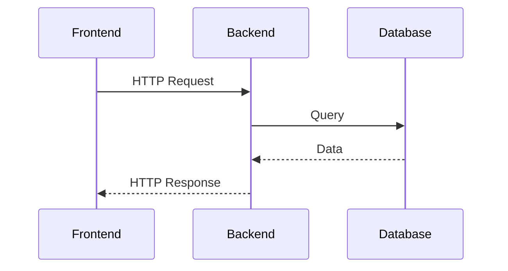
```mermaid
sequenceDiagram
    participant Frontend
    participant Backend
    participant Database
    
    Frontend->>Backend: HTTP Request
    Backend->>Database: Query
    Database-->>Backend: Data
    Backend-->>Frontend: HTTP Response
```

#### Webhook-Based API
```typescript
// Webhook Flow
Service A → Webhook → Service B
  ↑          ↓
  └──────────┘
  (Asynchronous)

// Example
app.post('/webhook/payment', async (req, res) => {
  // Acknowledge receipt immediately
  res.status(200).send();
  
  // Process asynchronously
  processPaymentWebhook(req.body);
});
```

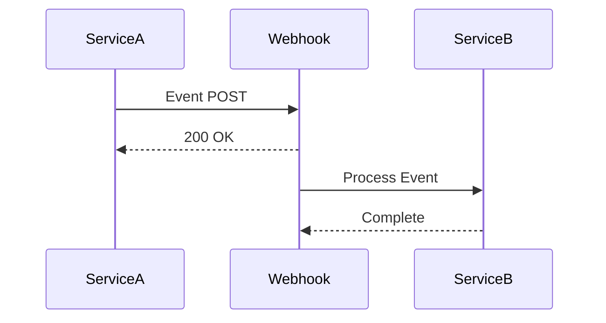
```mermaid
sequenceDiagram
    participant ServiceA
    participant Webhook
    participant ServiceB
    
    ServiceA->>Webhook: Event POST
    Webhook-->>ServiceA: 200 OK
    Webhook->>ServiceB: Process Event
    ServiceB-->>Webhook: Complete
```

### 🔄 **Comparison with External APIs (e.g., Stripe)**

#### Stripe API (REST)
```typescript
// Direct API Call
const payment = await stripe.paymentIntents.create({
  amount: 1000,
  currency: 'usd'
});
```

#### Stripe Webhooks
```typescript
// Webhook Handler
app.post('/webhook/stripe', async (req, res) => {
  const event = stripe.webhooks.constructEvent(
    req.body,
    req.headers['stripe-signature'],
    process.env.STRIPE_WEBHOOK_SECRET
  );

  switch (event.type) {
    case 'payment_intent.succeeded':
      await handleSuccessfulPayment(event.data.object);
      break;
    case 'payment_intent.failed':
      await handleFailedPayment(event.data.object);
      break;
  }

  res.json({ received: true });
});
```

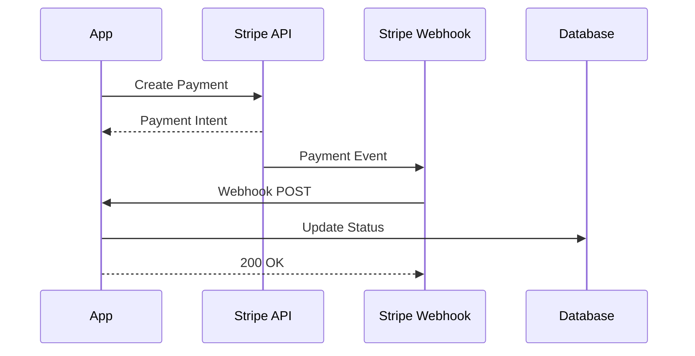
```mermaid
sequenceDiagram
    participant App
    participant Stripe API
    participant Stripe Webhook
    participant Database
    
    App->>Stripe API: Create Payment
    Stripe API-->>App: Payment Intent
    Stripe API->>Stripe Webhook: Payment Event
    Stripe Webhook->>App: Webhook POST
    App->>Database: Update Status
    App-->>Stripe Webhook: 200 OK
```

### 📊 **Key Differences**

#### 1. Communication Pattern
- **Traditional API**: Request-Response (Synchronous)
- **Webhook**: Event-Driven (Asynchronous)
- **External API**: Can be both, depending on use case

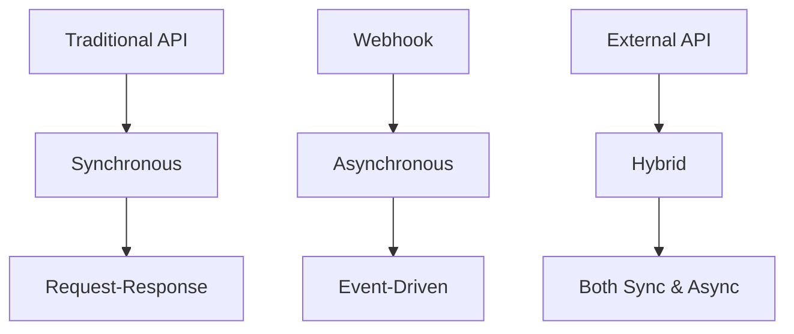
```mermaid
graph TD
    A[Traditional API] --> B[Synchronous]
    B --> C[Request-Response]
    
    D[Webhook] --> E[Asynchronous]
    E --> F[Event-Driven]
    
    G[External API] --> H[Hybrid]
    H --> I[Both Sync & Async]
```

#### 2. Data Flow
- **Traditional API**: 
  ```
  Client → Server → Response
  ```
- **Webhook**: 
  ```
  Service A → Webhook → Service B
  (Asynchronous Processing)
  ```
- **External API**: 
  ```
  Your App ↔ External Service
  (Bidirectional)
  ```

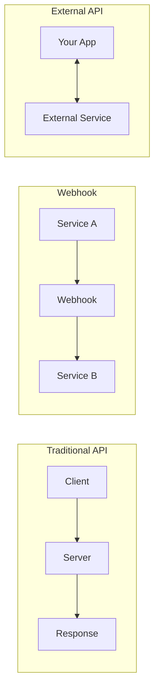
```mermaid
graph LR
    subgraph Traditional API
        A[Client] --> B[Server]
        B --> C[Response]
    end
    
    subgraph Webhook
        D[Service A] --> E[Webhook]
        E --> F[Service B]
    end
    
    subgraph External API
        G[Your App] <--> H[External Service]
    end
```

#### 3. Use Cases
- **Traditional API**: 
  - CRUD operations
  - Real-time data fetching
  - User interactions

- **Webhook**: 
  - Event notifications
  - Asynchronous processing
  - System integrations

- **External API**: 
  - Third-party service integration
  - Payment processing
  - External data synchronization

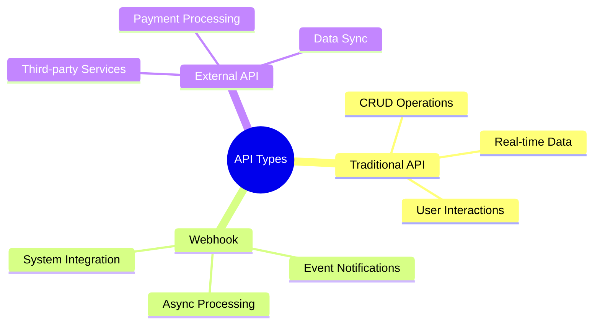
```mermaid
mindmap
    root((API Types))
        Traditional API
            CRUD Operations
            Real-time Data
            User Interactions
        Webhook
            Event Notifications
            Async Processing
            System Integration
        External API
            Third-party Services
            Payment Processing
            Data Sync
```

#### 4. Implementation Complexity
- **Traditional API**: 
  - Simpler to implement
  - Direct request-response
  - Easier to debug

- **Webhook**: 
  - More complex setup
  - Requires webhook endpoints
  - Needs proper error handling
  - Requires retry mechanisms

- **External API**: 
  - Varies by provider
  - Often requires authentication
  - May need webhook integration

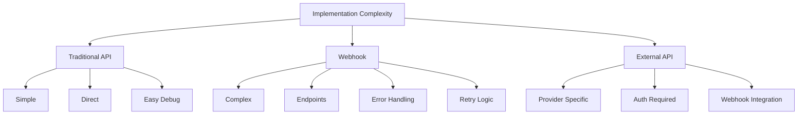
```mermaid
graph TD
    A[Implementation Complexity] --> B[Traditional API]
    A --> C[Webhook]
    A --> D[External API]
    
    B --> B1[Simple]
    B --> B2[Direct]
    B --> B3[Easy Debug]
    
    C --> C1[Complex]
    C --> C2[Endpoints]
    C --> C3[Error Handling]
    C --> C4[Retry Logic]
    
    D --> D1[Provider Specific]
    D --> D2[Auth Required]
    D --> D3[Webhook Integration]
```

### 🎯 **When to Use Each**

#### Use Traditional APIs When:
- You need immediate responses
- Data is required synchronously
- User interaction is involved
- Real-time updates are needed

#### Use Webhooks When:
- Processing can be asynchronous
- Event-driven architecture is needed
- System integration is required
- Long-running operations are involved

#### Use External APIs When:
- Third-party service integration is needed
- Payment processing is required
- External data synchronization is necessary
- Provider-specific functionality is needed

```mermaid
flowchart TD
    A[Need API?] --> B{Immediate Response?}
    B -->|Yes| C[Traditional API]
    B -->|No| D{Event Driven?}
    D -->|Yes| E[Webhook]
    D -->|No| F{External Service?}
    F -->|Yes| G[External API]
    F -->|No| C
```
